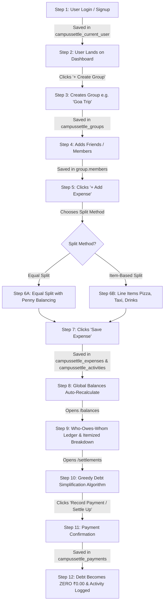

# CampusSettle — Complete End-to-End Project Flow & Click-by-Click Lifecycle (Hinglish + English)

Yeh document poore project ka **Master End-to-End Operational Flow** hai. Isme shuru se aakhri tak ek student ke real-life usage (Signup se lekar Bill Splitting aur Debt Settle karne tak) ko **"Ek Single Flow"** me samjhaya gaya hai. 

Har step par bataya gaya hai ki:
1. **User kis button / input par click karta hai.**
2. **Form me kya validate hota hai.**
3. **Background me kya Object / JSON banta hai.**
4. **Woh data exact kis LocalStorage Key aur kis Database Table me store hota hai.**
5. **Us ek click se poore project ke dusre pages par kya ripple effect (automatic update) hota hai.**

---

## 1. The Master Lifecycle Flowchart (Ek Single Story Flow)



---

## 2. Quick Master Table: Action $\rightarrow$ Created Object $\rightarrow$ Storage Location $\rightarrow$ Affected Pages

| User Action (Button Click) | React Component | Background Function Called | Exact Created Object / Entity | Exact Storage Location (LocalStorage Key & DB Table) | Ripple Effects (Dusre Pages Par Kya Badalta Hai) |
| :--- | :--- | :--- | :--- | :--- | :--- |
| **"Sign In"** button click | `src/pages/Login.jsx` | `userService.login(email, password)` | `UserSession` object with `id, name, email, avatar` | `campussettle_current_user` (Table: `users`) | Protected routes unlock; Header updates with user name and avatar. |
| **"Create Group"** submit click | `src/pages/Groups.jsx` | `groupService.create(data, currentUser)` | `Group` object with `id, name, category, members: [admin]` | `campussettle_groups` (Table: `groups`, `group_members`) | Dashboard group count increases; Activity feed logs "User created group"; Dropdowns include new group. |
| **"Add Member"** submit click | `src/components/groups/AddMemberModal.jsx` | `memberService.create(groupId, memberData)` | `Member` object with `id, name, email, role: 'member'` | Appended inside `group.members` in `campussettle_groups` | Member becomes selectable in Add Expense dropdowns; Member count on group card updates. |
| **"Save Expense"** (Equal Split) | `src/components/expenses/ExpenseWizard.jsx` | `expenseService.create(data, currentUser)` | `Expense` object with `amount, paidBy, splitMethod: 'equal', splits: {u1: 200, u2: 200}` | `campussettle_expenses` (Table: `expenses`, `expense_splits`) | **1.** Dashboard Net Balance recalculates.<br>**2.** `/balances` ledger shows who owes whom.<br>**3.** Recharts graphs update.<br>**4.** Activity feed logs new bill. |
| **"Save Expense"** (Item-Based Split) | `src/components/expenses/ExpenseItems.jsx` | `expenseService.create()` + `calculateItemBasedSplit()` | `Expense` object with `items: [{Pizza, ₹800, [u1, u2]}], splits: {u1: 400, u2: 400}` | `campussettle_expenses` (Table: `expenses`, `expense_items`, `expense_splits`) | Har student ke item-wise hisaab se balances update hote hain; Breakdown accordion me items dikhte hain. |
| **"Confirm Payment"** (Settle Up) | `src/components/settlements/PaymentModal.jsx` | `paymentService.create(data, currentUser)` | `Payment` object with `fromUser, toUser, amount, reference: SIM-UPI-xxxx` | `campussettle_payments` (Table: `payments`) | **1.** Debtor ka balance cut ho jata hai.<br>**2.** Creditor ka pending claim reduce ho jata hai.<br>**3.** Activity feed logs payment. |
| **"Currency Select"** change | `src/pages/Settings.jsx` | `setData(STORAGE_KEYS.SETTINGS)` | `{ currency: 'USD' / 'INR', ... }` | `campussettle_settings` (Table: `user_settings`) | Pure app me har jagah ₹, $, €, £ symbol dynamically swap ho jata hai bina page reload ke. |
| **"Reset Demo Data"** click | `src/pages/Settings.jsx` | `resetToDemoData()` | Full default dataset (4 users, 2 groups, 3 expenses, 1 payment) | All `campussettle_*` storage keys | State fresh seed state me reset ho jati hai aur user Dashboard par redirect ho jata hai. |

---

## 3. Step-by-Step Complete Lifecycle Walkthrough

---

### 🔹 STEP 1: Authentication & User Session Setup
* **Screen**: `/login` (`src/pages/Login.jsx`)
* **User Action**:
  - User quick-demo chip par click karta hai: `Bharat (Admin)` ya apni email/password enter karke **"Sign In"** button par click karta hai.
* **Code Execution**:
  1. `userService.login(email, password)` run hota hai.
  2. Storage se `campussettle_users` array me email & password check hota hai.
  3. Valid hone par session save hota hai.
* **What is Created (JSON)**:
  ```json
  {
    "id": "user-bharat",
    "name": "Bharat",
    "email": "bharat@campussettle.com",
    "avatar": "B",
    "avatarColor": "bg-blue-600",
    "college": "Silver Oak University"
  }
  ```
* **Where Stored**:
  - **LocalStorage Key**: `campussettle_current_user`
  - **Database Table**: `users`
  - **React State**: `App.jsx` ka `currentUser` state update hota hai.
* **Ripple Effect Across App**:
  - Protected routes guard (`ProtectedRoute.jsx`) check karta hai ki user logged-in hai.
  - Sidebar aur Top Header me user ka avatar (`B`) aur naam (`Bharat`) reflect hota hai.
  - User `/dashboard` par automatically redirect ho jata hai.

---

### 🔹 STEP 2: Creating a Group (e.g. "Goa Trip")
* **Screen**: `/groups` (`src/pages/Groups.jsx`)
* **User Action**:
  1. User top-right me **"+ Create Group"** button click karta hai.
  2. Modal khulta hai:
     - Group Name: `Goa Trip`
     - Category: `Travel`
     - Description: `Flight, hotel and beach expenses`
  3. User **"Create Group"** submit button click karta hai.
* **Code Execution**:
  1. `groupService.create(formData, currentUser)` call hota hai.
  2. Function ek unique ID generate karta hai (`group-` + timestamp/UUID).
  3. Creator (Bharat) ko automatically pehla member banata hai with `role: "admin"`.
* **What is Created (JSON)**:
  ```json
  {
    "id": "group-1741675200000",
    "name": "Goa Trip",
    "category": "Travel",
    "description": "Flight, hotel and beach expenses",
    "createdBy": "user-bharat",
    "createdAt": "2026-03-11T06:50:00.000Z",
    "members": [
      {
        "id": "user-bharat",
        "name": "Bharat",
        "email": "bharat@campussettle.com",
        "role": "admin",
        "status": "active"
      }
    ]
  }
  ```
* **Where Stored**:
  - **LocalStorage Key**: `campussettle_groups` (Naya group array me prepended ho jata hai).
  - **Database Table**: `groups` aur `group_members`.
  - **Secondary Storage**: `campussettle_activities` me activity log save hoti hai:
    ```json
    {
      "id": "act-1741675200001",
      "type": "group_created",
      "description": "Bharat created the group \"Goa Trip\"",
      "userId": "user-bharat",
      "userName": "Bharat",
      "groupId": "group-1741675200000",
      "groupName": "Goa Trip",
      "date": "2026-03-11T06:50:00.000Z"
    }
    ```
* **Ripple Effect Across App**:
  - Modal automatically close hota hai aur green toast show hota hai: *"Group created successfully!"*.
  - `/groups` page par naya card display hone lagta hai.
  - Dashboard par total groups count increment ho jata hai.
  - Expense create karte waqt Group selector dropdown me `"Goa Trip"` available ho jata hai.

---

### 🔹 STEP 3: Adding Members to Group
* **Screen**: `/groups/:id` (`src/pages/GroupDetails.jsx`)
* **User Action**:
  1. User group details page par **"Add Member"** button click karta hai.
  2. Modal khulta hai:
     - Name: `Aman`
     - Email: `aman@campussettle.com`
     - Role: `member`
  3. User **"Add Member"** par click karta hai.
* **Code Execution**:
  1. `memberService.create(groupId, memberData, currentUser)` run hota hai.
  2. Validation: Group ke existing members me check hota hai ki duplicate email toh nahi hai.
  3. New member ID assign hoti hai.
* **What is Created (JSON)**:
  ```json
  {
    "id": "user-aman",
    "name": "Aman",
    "email": "aman@campussettle.com",
    "role": "member",
    "status": "active"
  }
  ```
* **Where Stored**:
  - Target group ke `members` array ke andar push hota hai (`campussettle_groups`).
  - **Database Table**: `group_members`.
  - Activity log create hoti hai: *"Bharat added Aman to Goa Trip"*.
* **Ripple Effect Across App**:
  - Group card par member count `1` se `2` ho jata hai.
  - Add Expense form me member checkbox list me Aman ka naam checkbox me dikhne lagta hai.

---

### 🔹 STEP 4: Adding an Expense with Equal Split (Sab me Barabar)
* **Screen**: `/expenses/add` (`src/pages/AddExpense.jsx` $\rightarrow$ `src/components/expenses/ExpenseWizard.jsx`)
* **User Action (Step 1: Details)**:
  - Title: `Airport Taxi to Hotel`
  - Amount: `₹900.00`
  - Group: `Goa Trip` select kiya
  - Paid By: `Bharat` select kiya
  - Category: `Travel`
  - User **"Next Step"** click karta hai.
* **User Action (Step 2: Split Method)**:
  - User **"Equal Split"** tab select karta hai.
  - Checkbox me 3 members tick karta hai: `Bharat`, `Aman`, `Priya`.
* **Code Execution (The Math Engine)**:
  - `splitCalculator.calculateEqualSplit(900, ['user-bharat', 'user-aman', 'user-priya'])` run hota hai:
    - Base share: $900 / 3 = 300.00$
    - Remainder check: $900 - (300 \times 3) = 0.00$
    - Splits map banta hai: `Bharat: ₹300`, `Aman: ₹300`, `Priya: ₹300`.
* **User Action (Step 3: Save)**:
  - User summary check karta hai aur **"Save Expense"** click karta hai.
* **What is Created (JSON)**:
  ```json
  {
    "id": "expense-1741675300000",
    "name": "Airport Taxi to Hotel",
    "groupId": "group-1741675200000",
    "category": "Travel",
    "amount": 900.00,
    "paidBy": "user-bharat",
    "date": "2026-03-11T06:55:00.000Z",
    "splitMethod": "equal",
    "participants": ["user-bharat", "user-aman", "user-priya"],
    "splits": {
      "user-bharat": 300.00,
      "user-aman": 300.00,
      "user-priya": 300.00
    },
    "status": "unsettled"
  }
  ```
* **Where Stored**:
  - **LocalStorage Key**: `campussettle_expenses`
  - **Database Tables**: `expenses` aur `expense_splits`
  - Activity log save hoti hai: *"Bharat added Airport Taxi to Hotel in Goa Trip (₹900.00)"* in `campussettle_activities`.
* **Ripple Effect Across App**:
  - **Dashboard**: Bharat ke `Total Lent / You are owed` me ₹600 add ho jata hai (kyunki Bharat ne ₹900 diye aur uska apna share sirf ₹300 tha).
  - **Balances (`/balances`)**:
    - Aman owes Bharat ₹300.00
    - Priya owes Bharat ₹300.00
  - **Charts**: Recharts Monthly Spending aur Travel Category donut charts instant bar update karte hain.
  - Toast message aata hai: *"Expense created successfully!"* aur user `/expenses` page par navigate ho jata hai.

---

### 🔹 STEP 5: Adding an Expense with Item-Based Split (Student Bill Splitting)
* **Screen**: `/expenses/add`
* **User Action (Step 1)**:
  - Title: `Cafe Lunch`
  - Amount: `₹1,100.00`
  - Group: `Goa Trip`, Paid By: `Bharat`
* **User Action (Step 2: Itemize)**:
  - User **"Item-Based Split"** select karta hai.
  - Items add karta hai:
    - **Item 1**: Name: `Pizza`, Amount: `₹600` $\rightarrow$ Selects: `Bharat` & `Aman` (Each ₹300).
    - **Item 2**: Name: `Cold Coffee`, Amount: `₹300` $\rightarrow$ Selects: `Aman` & `Priya` (Each ₹150).
    - **Item 3**: Name: `Sandwich`, Amount: `₹200` $\rightarrow$ Selects: `Priya` (Full ₹200).
* **Code Execution**:
  - `calculateItemBasedSplit(items)` run hota hai:
    - Bharat total share: ₹300 (Pizza)
    - Aman total share: ₹300 (Pizza) + ₹150 (Coffee) = **₹450.00**
    - Priya total share: ₹150 (Coffee) + ₹200 (Sandwich) = **₹350.00**
    - Total verification: $300 + 450 + 350 = 1100.00$ (Exact match!).
* **What is Created (JSON)**:
  ```json
  {
    "id": "expense-1741675400000",
    "name": "Cafe Lunch",
    "groupId": "group-1741675200000",
    "amount": 1100.00,
    "paidBy": "user-bharat",
    "splitMethod": "item-based",
    "items": [
      { "id": "item-1", "name": "Pizza", "amount": 600, "participants": ["user-bharat", "user-aman"] },
      { "id": "item-2", "name": "Cold Coffee", "amount": 300, "participants": ["user-aman", "user-priya"] },
      { "id": "item-3", "name": "Sandwich", "amount": 200, "participants": ["user-priya"] }
    ],
    "splits": {
      "user-bharat": 300.00,
      "user-aman": 450.00,
      "user-priya": 350.00
    },
    "status": "unsettled"
  }
  ```
* **Where Stored**:
  - **LocalStorage Key**: `campussettle_expenses`
  - **Database Tables**: `expenses`, `expense_items`, `expense_splits`.
* **Ripple Effect Across App**:
  - Har member ka cumulative hisaab recalculate hota hai:
    - Aman owes Bharat: Previous ₹300 + New ₹450 = **₹750.00**
    - Priya owes Bharat: Previous ₹300 + New ₹350 = **₹650.00**
  - Expense details page par complete item breakdown table display hota hai.

---

### 🔹 STEP 6: Viewing Balances & Who-Owes-Whom
* **Screen**: `/balances` (`src/pages/Balances.jsx`)
* **Under the Hood Math (`balanceCalculator.js`)**:
  - Algorithm poore expenses array ko scan karta hai:
    1. Memberwise $TotalPaid$ calculate karta hai.
    2. Memberwise $TotalShare$ calculate karta hai.
    3. Pairwise matrix calculate karta hai: `pairwiseMatrix[debtor][creditor]`.
    4. Payments subtract karta hai taaki settled dues deduct ho sakein.
* **User Actions on this Page**:
  1. **"View Breakdown" Accordion Click**:
     - User Aman ke card ke neeche breakdown button click karta hai.
     - Accordion expand hota hai aur itemized bills dikhata hai:
       - *Airport Taxi to Hotel*: ₹300.00
       - *Cafe Lunch (Pizza & Coffee)*: ₹450.00
       - *Total Owed*: **₹750.00**
  2. **"Settle" Button Click**:
     - Direct Settle Modal khulta hai jisme Aman $\rightarrow$ Bharat aur ₹750.00 already bhara hua aata hai.

---

### 🔹 STEP 7: Debt Settlement (Settle Up Payment Record Karna)
* **Screen**: `/settlements` (`src/pages/Settlements.jsx` $\rightarrow$ `src/components/settlements/PaymentModal.jsx`)
* **User Action**:
  1. User suggested card par **"Record Payment"** click karta hai (ya top "+ Settle Up" button).
  2. Modal open hota hai:
     - Group: `Goa Trip`
     - From User: `Aman` (Debtor)
     - To User: `Bharat` (Creditor)
     - Amount: `₹750.00`
     - Notes: `Paid via Google Pay`
     - Reference: `SIM-UPI-582194` (Auto-generated simulation reference)
  3. User **"Confirm Payment"** green button par click karta hai.
* **Code Execution**:
  1. `paymentService.create(data, currentUser)` run hota hai.
  2. Naya payment object banta hai.
* **What is Created (JSON)**:
  ```json
  {
    "id": "pay-1741675500000",
    "groupId": "group-1741675200000",
    "fromUser": "user-aman",
    "toUser": "user-bharat",
    "amount": 750.00,
    "date": "2026-03-11T07:05:00.000Z",
    "status": "paid",
    "notes": "Paid via Google Pay",
    "reference": "SIM-UPI-582194"
  }
  ```
* **Where Stored**:
  - **LocalStorage Key**: `campussettle_payments`
  - **Database Table**: `payments`
  - Activity log save hoti hai: *"Aman paid Bharat ₹750.00"* in `campussettle_activities`.
* **Ripple Effect Across App (Instant Zero Debt)**:
  - **Balances (`/balances`)**: Aman ka Bharat ko debt **₹0.00** ho jata hai aur green badge lag jata hai: *"All settled up!"*.
  - **Dashboard**: Bharat ka `You are owed` balance ₹750 se kam ho jata hai.
  - **Settlements Page**: "Recent Settlements" table me nayi receipt card show hone lagti hai with reference `SIM-UPI-582194`.
  - Toast notification aata hai: *"Payment recorded successfully!"*.

---

### 🔹 STEP 8: Switching Currency in Settings
* **Screen**: `/settings` (`src/pages/Settings.jsx`)
* **User Action**:
  - User Currency dropdown me `USD ($)` ya `EUR (€)` choose karta hai.
* **Code Execution**:
  1. `setData(STORAGE_KEYS.SETTINGS, { ...settings, currency: 'USD' })` save hota hai.
  2. `currencyFormatter.js` ab `$` symbol aur `en-US` formatting use karne lagta hai.
* **What is Updated**:
  - **LocalStorage Key**: `campussettle_settings`
  - **Database Table**: `user_settings`
* **Ripple Effect**:
  - Pure app me bina page reload kiye sabhi jagah `₹750.00` automatically `$750.00` ban jata hai.

---

### 🔹 STEP 9: Reset to Demo Data
* **Screen**: `/settings`
* **User Action**:
  - User bottom me red button **"Reset to Demo Data"** click karta hai.
  - Confirm modal warning deta hai: *"Are you sure you want to reset all data?"*.
  - User "Yes, Reset Everything" click karta hai.
* **Code Execution**:
  1. `resetToDemoData()` run hota hai.
  2. Seed script `initialUsers`, `initialGroups`, `initialExpenses`, `initialPayments` ko fresh restore karta hai.
  3. `navigate('/dashboard')` trigger hota hai.
* **Ripple Effect**:
  - Saare test bills delete ho jate hain aur application clean demo state me wapis aa jati hai.

---

## 4. Summary of Data Persistence & Storage Keys

Har feature ke data ki exact key location:

```text
LocalStorage Keys:
├── campussettle_users        --> All registered users accounts
├── campussettle_current_user --> Currently logged-in user session
├── campussettle_groups       --> All groups and their nested members array
├── campussettle_expenses     --> All bills, line items, and split shares
├── campussettle_payments     --> All completed debt settlements & UPI references
├── campussettle_activities   --> Global timeline audit feed
└── campussettle_settings     --> Global currency and UI preferences
```
