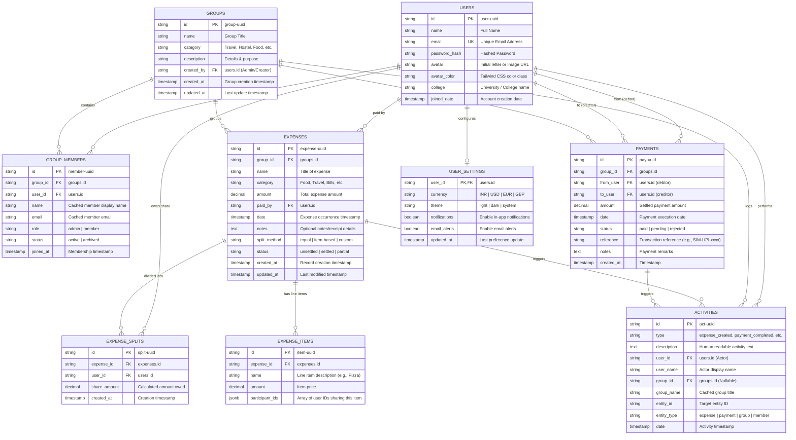

# CampusSettle — Complete Database Architecture & Field Mapping Specification

This document provides the **single source of truth** for database design, field definitions, relationships, and component-to-field mapping across the entire **CampusSettle** student expense-sharing project. Any AI agent, backend engineer, or database administrator can directly implement or generate backend services from this schema.

---

## 1. System Architecture & Entity Relationship Diagram (ERD)



---

## 2. Exhaustive Field-by-Field Mapping Specification

Every field listed below directly corresponds to state values, form inputs, calculations, and services in the frontend codebase.

### Table 1: `users` (User Accounts & Authentication)

| Database Column | Data Type | Constraints | Frontend File Location (`myapp/src/`) | Service / Utility Method | UI Element & Component | Sample Production Value |
| :--- | :--- | :--- | :--- | :--- | :--- | :--- |
| `id` | `VARCHAR(64)` | `PRIMARY KEY` | `src/data/initialUsers.js`, `src/pages/Login.jsx`, `src/pages/Profile.jsx` | `userService.getCurrentUser()`, `userService.getById()` | Profile header, User ID badge, Author avatar | `"user-bharat"` |
| `name` | `VARCHAR(100)` | `NOT NULL` | `src/pages/Profile.jsx`, `src/pages/Signup.jsx`, `src/components/layout/Header.jsx` | `userService.update()`, `userService.create()` | Top bar user dropdown, Edit Profile modal input | `"Bharat"` |
| `email` | `VARCHAR(255)` | `NOT NULL, UNIQUE` | `src/pages/Login.jsx`, `src/pages/Signup.jsx`, `src/pages/Profile.jsx` | `userService.login()`, `userService.signup()` | Login input `name="email"`, Signup form input | `"bharat@campussettle.com"` |
| `password_hash` | `VARCHAR(255)` | `NOT NULL` | `src/pages/Login.jsx`, `src/pages/Signup.jsx` | `userService.login()` | Auth password input (hashed via bcrypt in backend) | `"password123"` *(dev)* |
| `avatar` | `VARCHAR(10)` | `DEFAULT 'U'` | `src/components/common/Avatar.jsx` | `userService.create()`, `src/pages/Profile.jsx` | Letter initial avatar `<Avatar name={user.name} />` | `"B"` |
| `avatar_color` | `VARCHAR(50)` | `DEFAULT 'bg-blue-600'` | `src/components/common/Avatar.jsx` | `src/data/initialUsers.js` | Tailored Tailwind avatar background badge | `"bg-blue-600"` |
| `college` | `VARCHAR(150)` | `NULL` | `src/pages/Profile.jsx`, `src/pages/Signup.jsx` | `userService.update()` | Student University label on profile card | `"Silver Oak University"` |
| `joined_date` | `DATE` / `TIMESTAMPTZ` | `DEFAULT NOW()` | `src/pages/Profile.jsx` | `userService.create()` | "Member since [Month Year]" badge on profile | `"2026-01-15"` |

---

### Table 2: `groups` (Expense Sharing Groups)

| Database Column | Data Type | Constraints | Frontend File Location (`myapp/src/`) | Service / Utility Method | UI Element & Component | Sample Production Value |
| :--- | :--- | :--- | :--- | :--- | :--- | :--- |
| `id` | `VARCHAR(64)` | `PRIMARY KEY` | `src/pages/Groups.jsx`, `src/pages/GroupDetails.jsx` | `groupService.getById()`, `groupService.getAll()` | URL param `/:id`, Group card data attribute | `"group-goa-trip"` |
| `name` | `VARCHAR(120)` | `NOT NULL` | `src/components/groups/GroupCard.jsx`, `src/pages/GroupDetails.jsx` | `groupService.create()`, `groupService.update()` | Group Header title, Create Group modal input | `"Goa Trip"` |
| `category` | `VARCHAR(50)` | `NOT NULL, DEFAULT 'Other'` | `src/pages/Groups.jsx`, `src/components/groups/GroupCard.jsx` | `groupService.create()` | Category badge (`Travel`, `Hostel`, `Food`, `Event`, `Project`) | `"Travel"` |
| `description` | `TEXT` | `NULL` | `src/pages/GroupDetails.jsx`, `src/components/groups/GroupCard.jsx` | `groupService.create()`, `groupService.update()` | Subtitle summary under group title | `"Vacation expenses, food, cabs, and sightseeing"` |
| `created_by` | `VARCHAR(64)` | `NOT NULL, FK -> users.id` | `src/pages/GroupDetails.jsx` | `groupService.create()` | "Created by [Name]" info tag | `"user-bharat"` |
| `created_at` | `TIMESTAMPTZ` | `DEFAULT NOW()` | `src/pages/GroupDetails.jsx`, `src/pages/Groups.jsx` | `groupService.create()` | Group timestamp with `date-fns formatDistanceToNow` | `"2026-03-01T10:00:00.000Z"` |
| `updated_at` | `TIMESTAMPTZ` | `DEFAULT NOW()` | `src/pages/GroupDetails.jsx` | `groupService.update()` | Audit timestamp | `"2026-03-01T10:00:00.000Z"` |

---

### Table 3: `group_members` (Group Memberships & Permissions)

| Database Column | Data Type | Constraints | Frontend File Location (`myapp/src/`) | Service / Utility Method | UI Element & Component | Sample Production Value |
| :--- | :--- | :--- | :--- | :--- | :--- | :--- |
| `id` | `VARCHAR(64)` | `PRIMARY KEY` | `src/components/groups/MemberList.jsx`, `src/components/groups/AddMemberModal.jsx` | `memberService.create()`, `memberService.delete()` | Member row key, Remove Member action button | `"user-aman"` |
| `group_id` | `VARCHAR(64)` | `NOT NULL, FK -> groups.id ON DELETE CASCADE` | `src/pages/GroupDetails.jsx` | `memberService.getByGroupId()` | Scopes member list to current group | `"group-goa-trip"` |
| `user_id` | `VARCHAR(64)` | `NULL, FK -> users.id` | `src/components/groups/MemberList.jsx` | `memberService.create()` | Links to registered user account (if registered) | `"user-aman"` |
| `name` | `VARCHAR(100)` | `NOT NULL` | `src/components/groups/MemberList.jsx`, `src/components/expenses/MemberSelector.jsx` | `memberService.create()`, `memberService.update()` | Member name pill, multi-select checkboxes | `"Aman"` |
| `email` | `VARCHAR(255)` | `NOT NULL` | `src/components/groups/AddMemberModal.jsx` | `memberService.create()` | Member email input in "Add Member" modal | `"aman@campussettle.com"` |
| `role` | `VARCHAR(20)` | `DEFAULT 'member'` | `src/components/groups/MemberList.jsx` | `memberService.update()` | Role badge: `admin` (Purple) vs `member` (Gray) | `"member"` |
| `status` | `VARCHAR(20)` | `DEFAULT 'active'` | `src/components/groups/MemberList.jsx` | `memberService.delete()` | Status indicator: `active` vs `archived` | `"active"` |
| `joined_at` | `TIMESTAMPTZ` | `DEFAULT NOW()` | `src/components/groups/MemberList.jsx` | `memberService.create()` | Joined date formatted tag | `"2026-03-01T10:00:00.000Z"` |

---

### Table 4: `expenses` (Primary Bills & Expense Entries)

| Database Column | Data Type | Constraints | Frontend File Location (`myapp/src/`) | Service / Utility Method | UI Element & Component | Sample Production Value |
| :--- | :--- | :--- | :--- | :--- | :--- | :--- |
| `id` | `VARCHAR(64)` | `PRIMARY KEY` | `src/pages/Expenses.jsx`, `src/pages/ExpenseDetails.jsx`, `src/pages/AddExpense.jsx` | `expenseService.getById()`, `expenseService.create()` | Route `/:id`, Edit button, Delete confirmation modal | `"expense-goa-dinner"` |
| `group_id` | `VARCHAR(64)` | `NOT NULL, FK -> groups.id ON DELETE CASCADE` | `src/components/expenses/BillDetails.jsx`, `src/pages/AddExpense.jsx` | `expenseService.getByGroupId()` | Group dropdown select `<Select name="groupId" />` | `"group-goa-trip"` |
| `name` | `VARCHAR(150)` | `NOT NULL` | `src/components/expenses/BillDetails.jsx`, `src/components/expenses/ExpenseCard.jsx` | `expenseService.create()`, `expenseService.update()` | Expense Title input `name="name"`, list row title | `"Dinner"` |
| `category` | `VARCHAR(50)` | `NOT NULL, DEFAULT 'Other'` | `src/components/expenses/BillDetails.jsx`, `src/pages/Expenses.jsx` | `expenseService.create()`, `src/components/dashboard/SpendingChart.jsx` | Category select (`Food`, `Travel`, `Bills`, etc.), Donut chart category key | `"Food"` |
| `amount` | `NUMERIC(12,2)` | `NOT NULL, CHECK (amount > 0)` | `src/components/expenses/BillDetails.jsx`, `src/components/expenses/ExpensePreview.jsx` | `expenseService.create()`, `formatCurrency()` | Total bill amount input `name="amount"`, Big header total | `2500.00` |
| `paid_by` | `VARCHAR(64)` | `NOT NULL, FK -> users.id` | `src/components/expenses/BillDetails.jsx`, `src/components/expenses/ExpenseCard.jsx` | `expenseService.create()`, `calculateGroupBalances()` | "Paid by [Name]" dropdown selector | `"user-bharat"` |
| `date` | `TIMESTAMPTZ` | `NOT NULL, DEFAULT NOW()` | `src/components/expenses/BillDetails.jsx` | `expenseService.create()`, `date-fns format()` | Date picker input `type="date"` | `"2026-03-09T20:45:00.000Z"` |
| `notes` | `TEXT` | `NULL` | `src/components/expenses/BillDetails.jsx`, `src/pages/ExpenseDetails.jsx` | `expenseService.create()`, `expenseService.update()` | Notes/Remarks textarea input | `"Italian dinner night at Fisherman Wharf"` |
| `split_method` | `VARCHAR(30)` | `NOT NULL, DEFAULT 'equal'` | `src/components/expenses/SplitMethod.jsx`, `src/components/expenses/ExpenseWizard.jsx` | `splitCalculator.js` | Tab selector: `equal`, `item-based`, `custom` | `"item-based"` |
| `status` | `VARCHAR(20)` | `DEFAULT 'unsettled'` | `src/components/expenses/ExpenseCard.jsx`, `src/pages/Expenses.jsx` | `expenseService.update()` | Status badge: `unsettled` (Amber) vs `settled` (Green) | `"unsettled"` |
| `created_at` | `TIMESTAMPTZ` | `DEFAULT NOW()` | `src/pages/ExpenseDetails.jsx` | `expenseService.create()` | Audit creation time | `"2026-03-09T21:00:00.000Z"` |
| `updated_at` | `TIMESTAMPTZ` | `DEFAULT NOW()` | `src/pages/ExpenseDetails.jsx` | `expenseService.update()` | Audit modification time | `"2026-03-09T21:00:00.000Z"` |

---

### Table 5: `expense_items` (Item-Based Split Line Items)

| Database Column | Data Type | Constraints | Frontend File Location (`myapp/src/`) | Service / Utility Method | UI Element & Component | Sample Production Value |
| :--- | :--- | :--- | :--- | :--- | :--- | :--- |
| `id` | `VARCHAR(64)` | `PRIMARY KEY` | `src/components/expenses/ExpenseItems.jsx` | `splitCalculator.calculateItemBasedSplit()` | Line item DOM row key | `"item-1"` |
| `expense_id` | `VARCHAR(64)` | `NOT NULL, FK -> expenses.id ON DELETE CASCADE` | `src/components/expenses/ExpenseItems.jsx` | `expenseService.create()` | Parent expense relationship | `"expense-goa-dinner"` |
| `name` | `VARCHAR(120)` | `NOT NULL` | `src/components/expenses/ExpenseItems.jsx` | `ExpenseItems` state | Item name input (e.g. "Pizza", "Drinks", "Dessert") | `"Pizza"` |
| `amount` | `NUMERIC(10,2)` | `NOT NULL, CHECK (amount >= 0)` | `src/components/expenses/ExpenseItems.jsx` | `ExpenseItems` state, penny balancing | Item cost input `placeholder="Amount"` | `800.00` |
| `participant_ids` | `JSONB` or join table | `NOT NULL` | `src/components/expenses/ExpenseItems.jsx` | `calculateItemBasedSplit()` | Multi-member pill toggles per item row | `["user-bharat", "user-aman", "user-priya"]` |

---

### Table 6: `expense_splits` (Individual Debt Portions)

| Database Column | Data Type | Constraints | Frontend File Location (`myapp/src/`) | Service / Utility Method | UI Element & Component | Sample Production Value |
| :--- | :--- | :--- | :--- | :--- | :--- | :--- |
| `id` | `VARCHAR(64)` | `PRIMARY KEY` | `src/components/expenses/ExpensePreview.jsx` | `calculateEqualSplit()`, `validateSplits()` | Split item unique key | `"split-exp1-u1"` |
| `expense_id` | `VARCHAR(64)` | `NOT NULL, FK -> expenses.id ON DELETE CASCADE` | `src/pages/ExpenseDetails.jsx` | `expenseService.create()` | Foreign key to parent expense | `"expense-goa-dinner"` |
| `user_id` | `VARCHAR(64)` | `NOT NULL, FK -> users.id` | `src/components/expenses/ExpensePreview.jsx` | `calculateGroupBalances()` | Member identifier for debtor | `"user-aman"` |
| `share_amount` | `NUMERIC(12,2)` | `NOT NULL, CHECK (share_amount >= 0)` | `src/components/expenses/ExpensePreview.jsx` | `splitCalculator.js` | Calculated share pill: "₹450.00" | `450.00` |

---

### Table 7: `payments` (Settlement Transactions & Receipts)

| Database Column | Data Type | Constraints | Frontend File Location (`myapp/src/`) | Service / Utility Method | UI Element & Component | Sample Production Value |
| :--- | :--- | :--- | :--- | :--- | :--- | :--- |
| `id` | `VARCHAR(64)` | `PRIMARY KEY` | `src/pages/Settlements.jsx`, `src/components/settlements/SettlementCard.jsx` | `paymentService.create()`, `paymentService.getAll()` | Payment receipt key, settlement record card | `"pay-hostel-settle-1"` |
| `group_id` | `VARCHAR(64)` | `NOT NULL, FK -> groups.id ON DELETE CASCADE` | `src/components/settlements/PaymentModal.jsx` | `paymentService.create()` | Scope settlement to current group | `"group-hostel-304"` |
| `from_user` | `VARCHAR(64)` | `NOT NULL, FK -> users.id` | `src/components/settlements/PaymentModal.jsx` | `paymentService.create()`, `calculateGroupBalances()` | Payer / Debtor dropdown (Who is paying) | `"user-bharat"` |
| `to_user` | `VARCHAR(64)` | `NOT NULL, FK -> users.id` | `src/components/settlements/PaymentModal.jsx` | `paymentService.create()`, `calculateGroupBalances()` | Payee / Creditor dropdown (Who receives money) | `"user-aman"` |
| `amount` | `NUMERIC(12,2)` | `NOT NULL, CHECK (amount > 0)` | `src/components/settlements/PaymentModal.jsx` | `paymentService.create()`, `formatCurrency()` | Settle amount input, settlement summary amount | `499.50` |
| `date` | `TIMESTAMPTZ` | `NOT NULL, DEFAULT NOW()` | `src/components/settlements/PaymentModal.jsx` | `paymentService.create()` | Date of settlement completion | `"2026-03-06T14:20:00.000Z"` |
| `status` | `VARCHAR(20)` | `DEFAULT 'paid'` | `src/components/settlements/SettlementCard.jsx` | `paymentService.create()`, `paymentService.update()` | Badge: `paid` (Green), `pending` (Yellow) | `"paid"` |
| `reference` | `VARCHAR(60)` | `NULL` | `src/components/settlements/SettlementCard.jsx` | `paymentService.create()` | UPI/Bank reference code tag (e.g. `SIM-UPI-9823412`) | `"SIM-UPI-9823412"` |
| `notes` | `TEXT` | `NULL` | `src/components/settlements/PaymentModal.jsx` | `paymentService.create()` | Remark / Settlement description | `"Settled WiFi bill via simulated UPI"` |
| `created_at` | `TIMESTAMPTZ` | `DEFAULT NOW()` | `src/pages/Settlements.jsx` | `paymentService.create()` | Audit creation timestamp | `"2026-03-06T14:20:00.000Z"` |

---

### Table 8: `activities` (Audit Trail & Activity Feeds)

| Database Column | Data Type | Constraints | Frontend File Location (`myapp/src/`) | Service / Utility Method | UI Element & Component | Sample Production Value |
| :--- | :--- | :--- | :--- | :--- | :--- | :--- |
| `id` | `VARCHAR(64)` | `PRIMARY KEY` | `src/pages/Activity.jsx`, `src/components/dashboard/RecentActivity.jsx` | `activityService.getAll()`, `activityService.create()` | Feed item row key | `"act-1"` |
| `type` | `VARCHAR(40)` | `NOT NULL` | `src/pages/Activity.jsx` | `activityService.create()` | Icon resolver (`expense_created`, `payment_completed`, `group_created`, `member_added`) | `"expense_created"` |
| `description` | `TEXT` | `NOT NULL` | `src/pages/Activity.jsx`, `src/components/dashboard/RecentActivity.jsx` | `activityService.create()` | Primary activity timeline sentence | `"Bharat added \"Dinner\" in Goa Trip (₹2,500.00)"` |
| `user_id` | `VARCHAR(64)` | `NOT NULL, FK -> users.id` | `src/pages/Activity.jsx` | `activityService.create()` | User filter dropdown selector | `"user-bharat"` |
| `user_name` | `VARCHAR(100)` | `NOT NULL` | `src/pages/Activity.jsx` | `activityService.create()` | User avatar & actor tag | `"Bharat"` |
| `group_id` | `VARCHAR(64)` | `NULL, FK -> groups.id` | `src/pages/Activity.jsx` | `activityService.create()` | Group filter dropdown selector | `"group-goa-trip"` |
| `group_name` | `VARCHAR(120)` | `NULL` | `src/pages/Activity.jsx` | `activityService.create()` | Group chip badge | `"Goa Trip"` |
| `date` | `TIMESTAMPTZ` | `DEFAULT NOW()` | `src/pages/Activity.jsx`, `src/components/dashboard/RecentActivity.jsx` | `activityService.create()`, `formatDistanceToNow` | Relative time tag ("3 hours ago", "Yesterday") | `"2026-03-09T20:45:00.000Z"` |
| `entity_id` | `VARCHAR(64)` | `NULL` | `src/pages/Activity.jsx` | `activityService.create()` | Clickable link target ID (to navigate to expense/group) | `"expense-goa-dinner"` |
| `entity_type` | `VARCHAR(30)` | `NULL` | `src/pages/Activity.jsx` | `activityService.create()` | Link router discriminator (`expense`, `group`, `payment`) | `"expense"` |

---

### Table 9: `user_settings` (Application & User Preferences)

| Database Column | Data Type | Constraints | Frontend File Location (`myapp/src/`) | Service / Utility Method | UI Element & Component | Sample Production Value |
| :--- | :--- | :--- | :--- | :--- | :--- | :--- |
| `user_id` | `VARCHAR(64)` | `PRIMARY KEY, FK -> users.id` | `src/pages/Settings.jsx`, `src/utils/currencyFormatter.js` | `getCurrencyCode()`, `getCurrencySymbol()` | Settings form state scope | `"user-bharat"` |
| `currency` | `VARCHAR(10)` | `NOT NULL, DEFAULT 'INR'` | `src/pages/Settings.jsx`, `src/utils/currencyFormatter.js` | `formatCurrency()` | Currency select dropdown (`INR (₹)`, `USD ($)`, `EUR (€)`, `GBP (£)`) | `"INR"` |
| `theme` | `VARCHAR(15)` | `DEFAULT 'light'` | `src/pages/Settings.jsx` | `Settings.jsx` toggle | Theme switch button (`light`, `dark`) | `"light"` |
| `notifications` | `BOOLEAN` | `DEFAULT TRUE` | `src/pages/Settings.jsx` | `Settings.jsx` toggle | In-App notifications switch toggle | `true` |
| `email_alerts` | `BOOLEAN` | `DEFAULT TRUE` | `src/pages/Settings.jsx` | `Settings.jsx` toggle | Email alerts switch toggle | `true` |
| `updated_at` | `TIMESTAMPTZ` | `DEFAULT NOW()` | `src/pages/Settings.jsx` | `setData(STORAGE_KEYS.SETTINGS)` | Last settings update timestamp | `"2026-03-11T12:00:00.000Z"` |

---

## 3. Production Ready SQL DDL (PostgreSQL / Supabase / Neon)

Execute this script in any PostgreSQL-compliant database to instantiate all tables, relational integrity, and optimal indexes:

```sql
-- ============================================================
-- 1. EXTENSIONS & ENUMS
-- ============================================================
CREATE EXTENSION IF NOT EXISTS "uuid-ossp";

-- ============================================================
-- 2. USERS TABLE
-- ============================================================
CREATE TABLE IF NOT EXISTS users (
    id VARCHAR(64) PRIMARY KEY,
    name VARCHAR(100) NOT NULL,
    email VARCHAR(255) NOT NULL UNIQUE,
    password_hash VARCHAR(255) NOT NULL,
    avatar VARCHAR(10) DEFAULT 'U',
    avatar_color VARCHAR(50) DEFAULT 'bg-blue-600',
    college VARCHAR(150),
    joined_date DATE DEFAULT CURRENT_DATE,
    created_at TIMESTAMPTZ DEFAULT NOW(),
    updated_at TIMESTAMPTZ DEFAULT NOW()
);

CREATE INDEX IF NOT EXISTS idx_users_email ON users(email);

-- ============================================================
-- 3. GROUPS TABLE
-- ============================================================
CREATE TABLE IF NOT EXISTS groups (
    id VARCHAR(64) PRIMARY KEY,
    name VARCHAR(120) NOT NULL,
    category VARCHAR(50) NOT NULL DEFAULT 'Other',
    description TEXT,
    created_by VARCHAR(64) NOT NULL REFERENCES users(id) ON DELETE CASCADE,
    created_at TIMESTAMPTZ DEFAULT NOW(),
    updated_at TIMESTAMPTZ DEFAULT NOW()
);

CREATE INDEX IF NOT EXISTS idx_groups_created_by ON groups(created_by);

-- ============================================================
-- 4. GROUP_MEMBERS TABLE
-- ============================================================
CREATE TABLE IF NOT EXISTS group_members (
    id VARCHAR(64) PRIMARY KEY,
    group_id VARCHAR(64) NOT NULL REFERENCES groups(id) ON DELETE CASCADE,
    user_id VARCHAR(64) REFERENCES users(id) ON DELETE SET NULL,
    name VARCHAR(100) NOT NULL,
    email VARCHAR(255) NOT NULL,
    role VARCHAR(20) DEFAULT 'member' CHECK (role IN ('admin', 'member')),
    status VARCHAR(20) DEFAULT 'active' CHECK (status IN ('active', 'archived')),
    joined_at TIMESTAMPTZ DEFAULT NOW(),
    CONSTRAINT uq_group_member_email UNIQUE(group_id, email)
);

CREATE INDEX IF NOT EXISTS idx_group_members_group_id ON group_members(group_id);
CREATE INDEX IF NOT EXISTS idx_group_members_user_id ON group_members(user_id);

-- ============================================================
-- 5. EXPENSES TABLE
-- ============================================================
CREATE TABLE IF NOT EXISTS expenses (
    id VARCHAR(64) PRIMARY KEY,
    group_id VARCHAR(64) NOT NULL REFERENCES groups(id) ON DELETE CASCADE,
    name VARCHAR(150) NOT NULL,
    category VARCHAR(50) NOT NULL DEFAULT 'Other',
    amount NUMERIC(12, 2) NOT NULL CHECK (amount > 0),
    paid_by VARCHAR(64) NOT NULL REFERENCES users(id) ON DELETE RESTRICT,
    date TIMESTAMPTZ NOT NULL DEFAULT NOW(),
    notes TEXT,
    split_method VARCHAR(30) NOT NULL DEFAULT 'equal' CHECK (split_method IN ('equal', 'item-based', 'custom')),
    status VARCHAR(20) DEFAULT 'unsettled' CHECK (status IN ('unsettled', 'settled', 'partial')),
    created_at TIMESTAMPTZ DEFAULT NOW(),
    updated_at TIMESTAMPTZ DEFAULT NOW()
);

CREATE INDEX IF NOT EXISTS idx_expenses_group_id ON expenses(group_id);
CREATE INDEX IF NOT EXISTS idx_expenses_paid_by ON expenses(paid_by);
CREATE INDEX IF NOT EXISTS idx_expenses_date ON expenses(date DESC);

-- ============================================================
-- 6. EXPENSE_ITEMS TABLE (Item-based line items)
-- ============================================================
CREATE TABLE IF NOT EXISTS expense_items (
    id VARCHAR(64) PRIMARY KEY,
    expense_id VARCHAR(64) NOT NULL REFERENCES expenses(id) ON DELETE CASCADE,
    name VARCHAR(120) NOT NULL,
    amount NUMERIC(10, 2) NOT NULL CHECK (amount >= 0),
    participant_ids JSONB NOT NULL DEFAULT '[]'::jsonb,
    created_at TIMESTAMPTZ DEFAULT NOW()
);

CREATE INDEX IF NOT EXISTS idx_expense_items_expense_id ON expense_items(expense_id);

-- ============================================================
-- 7. EXPENSE_SPLITS TABLE (Direct breakdown per member)
-- ============================================================
CREATE TABLE IF NOT EXISTS expense_splits (
    id VARCHAR(64) PRIMARY KEY,
    expense_id VARCHAR(64) NOT NULL REFERENCES expenses(id) ON DELETE CASCADE,
    user_id VARCHAR(64) NOT NULL REFERENCES users(id) ON DELETE CASCADE,
    share_amount NUMERIC(12, 2) NOT NULL CHECK (share_amount >= 0),
    created_at TIMESTAMPTZ DEFAULT NOW(),
    CONSTRAINT uq_expense_user_split UNIQUE(expense_id, user_id)
);

CREATE INDEX IF NOT EXISTS idx_expense_splits_expense ON expense_splits(expense_id);
CREATE INDEX IF NOT EXISTS idx_expense_splits_user ON expense_splits(user_id);

-- ============================================================
-- 8. PAYMENTS TABLE (Debt settlements)
-- ============================================================
CREATE TABLE IF NOT EXISTS payments (
    id VARCHAR(64) PRIMARY KEY,
    group_id VARCHAR(64) NOT NULL REFERENCES groups(id) ON DELETE CASCADE,
    from_user VARCHAR(64) NOT NULL REFERENCES users(id) ON DELETE RESTRICT,
    to_user VARCHAR(64) NOT NULL REFERENCES users(id) ON DELETE RESTRICT,
    amount NUMERIC(12, 2) NOT NULL CHECK (amount > 0),
    date TIMESTAMPTZ NOT NULL DEFAULT NOW(),
    status VARCHAR(20) DEFAULT 'paid' CHECK (status IN ('paid', 'pending', 'rejected')),
    reference VARCHAR(60),
    notes TEXT,
    created_at TIMESTAMPTZ DEFAULT NOW()
);

CREATE INDEX IF NOT EXISTS idx_payments_group_id ON payments(group_id);
CREATE INDEX IF NOT EXISTS idx_payments_from_user ON payments(from_user);
CREATE INDEX IF NOT EXISTS idx_payments_to_user ON payments(to_user);

-- ============================================================
-- 9. ACTIVITIES TABLE (Audit trail log)
-- ============================================================
CREATE TABLE IF NOT EXISTS activities (
    id VARCHAR(64) PRIMARY KEY,
    type VARCHAR(40) NOT NULL,
    description TEXT NOT NULL,
    user_id VARCHAR(64) NOT NULL REFERENCES users(id) ON DELETE CASCADE,
    user_name VARCHAR(100) NOT NULL,
    group_id VARCHAR(64) REFERENCES groups(id) ON DELETE SET NULL,
    group_name VARCHAR(120),
    entity_id VARCHAR(64),
    entity_type VARCHAR(30),
    date TIMESTAMPTZ DEFAULT NOW()
);

CREATE INDEX IF NOT EXISTS idx_activities_date ON activities(date DESC);
CREATE INDEX IF NOT EXISTS idx_activities_group_id ON activities(group_id);
CREATE INDEX IF NOT EXISTS idx_activities_user_id ON activities(user_id);

-- ============================================================
-- 10. USER_SETTINGS TABLE
-- ============================================================
CREATE TABLE IF NOT EXISTS user_settings (
    user_id VARCHAR(64) PRIMARY KEY REFERENCES users(id) ON DELETE CASCADE,
    currency VARCHAR(10) NOT NULL DEFAULT 'INR',
    theme VARCHAR(15) DEFAULT 'light',
    notifications BOOLEAN DEFAULT TRUE,
    email_alerts BOOLEAN DEFAULT TRUE,
    updated_at TIMESTAMPTZ DEFAULT NOW()
);
```

---

## 4. Prisma Schema (`prisma/schema.prisma`)

For Node.js / TypeScript backends utilizing Prisma ORM:

```prisma
datasource db {
  provider = "postgresql"
  url      = env("DATABASE_URL")
}

generator client {
  provider = "prisma-client-js"
}

model User {
  id             String         @id @default(uuid())
  name           String
  email          String         @unique
  passwordHash   String         @map("password_hash")
  avatar         String         @default("U")
  avatarColor    String         @default("bg-blue-600") @map("avatar_color")
  college        String?
  joinedDate     DateTime       @default(now()) @map("joined_date")
  createdAt      DateTime       @default(now()) @map("created_at")
  updatedAt      DateTime       @updatedAt @map("updated_at")

  createdGroups  Group[]        @relation("GroupCreator")
  memberships    GroupMember[]
  paidExpenses   Expense[]      @relation("ExpensePayer")
  expenseSplits  ExpenseSplit[]
  sentPayments   Payment[]      @relation("PaymentSender")
  receivedPayments Payment[]    @relation("PaymentReceiver")
  activities     Activity[]
  settings       UserSettings?

  @@map("users")
}

model Group {
  id          String        @id @default(uuid())
  name        String
  category    String        @default("Other")
  description String?
  createdBy   String        @map("created_by")
  createdAt   DateTime      @default(now()) @map("created_at")
  updatedAt   DateTime      @updatedAt @map("updated_at")

  creator     User          @relation("GroupCreator", fields: [createdBy], references: [id], onDelete: Cascade)
  members     GroupMember[]
  expenses    Expense[]
  payments    Payment[]
  activities  Activity[]

  @@map("groups")
}

model GroupMember {
  id        String   @id @default(uuid())
  groupId   String   @map("group_id")
  userId    String?  @map("user_id")
  name      String
  email     String
  role      String   @default("member")
  status    String   @default("active")
  joinedAt  DateTime @default(now()) @map("joined_at")

  group     Group    @relation(fields: [groupId], references: [id], onDelete: Cascade)
  user      User?    @relation(fields: [userId], references: [id], onDelete: SetNull)

  @@unique([groupId, email])
  @@map("group_members")
}

model Expense {
  id          String         @id @default(uuid())
  groupId     String         @map("group_id")
  name        String
  category    String         @default("Other")
  amount      Decimal        @db.Decimal(12, 2)
  paidBy      String         @map("paid_by")
  date        DateTime       @default(now())
  notes       String?
  splitMethod String         @default("equal") @map("split_method")
  status      String         @default("unsettled")
  createdAt   DateTime       @default(now()) @map("created_at")
  updatedAt   DateTime       @updatedAt @map("updated_at")

  group       Group          @relation(fields: [groupId], references: [id], onDelete: Cascade)
  payer       User           @relation("ExpensePayer", fields: [paidBy], references: [id], onDelete: Restrict)
  items       ExpenseItem[]
  splits      ExpenseSplit[]

  @@map("expenses")
}

model ExpenseItem {
  id             String   @id @default(uuid())
  expenseId      String   @map("expense_id")
  name           String
  amount         Decimal  @db.Decimal(10, 2)
  participantIds Json     @map("participant_ids")
  createdAt      DateTime @default(now()) @map("created_at")

  expense        Expense  @relation(fields: [expenseId], references: [id], onDelete: Cascade)

  @@map("expense_items")
}

model ExpenseSplit {
  id          String   @id @default(uuid())
  expenseId   String   @map("expense_id")
  userId      String   @map("user_id")
  shareAmount Decimal  @db.Decimal(12, 2) @map("share_amount")
  createdAt   DateTime @default(now()) @map("created_at")

  expense     Expense  @relation(fields: [expenseId], references: [id], onDelete: Cascade)
  user        User     @relation(fields: [userId], references: [id], onDelete: Cascade)

  @@unique([expenseId, userId])
  @@map("expense_splits")
}

model Payment {
  id        String   @id @default(uuid())
  groupId   String   @map("group_id")
  fromUser  String   @map("from_user")
  toUser    String   @map("to_user")
  amount    Decimal  @db.Decimal(12, 2)
  date      DateTime @default(now())
  status    String   @default("paid")
  reference String?
  notes     String?
  createdAt DateTime @default(now()) @map("created_at")

  group     Group    @relation(fields: [groupId], references: [id], onDelete: Cascade)
  sender    User     @relation("PaymentSender", fields: [fromUser], references: [id], onDelete: Restrict)
  receiver  User     @relation("PaymentReceiver", fields: [toUser], references: [id], onDelete: Restrict)

  @@map("payments")
}

model Activity {
  id          String   @id @default(uuid())
  type        String
  description String
  userId      String   @map("user_id")
  userName    String   @map("user_name")
  groupId     String?  @map("group_id")
  groupName   String?  @map("group_name")
  entityId    String?  @map("entity_id")
  entityType  String?  @map("entity_type")
  date        DateTime @default(now())

  user        User     @relation(fields: [userId], references: [id], onDelete: Cascade)
  group       Group?   @relation(fields: [groupId], references: [id], onDelete: SetNull)

  @@map("activities")
}

model UserSettings {
  userId        String   @id @map("user_id")
  currency      String   @default("INR")
  theme         String   @default("light")
  notifications Boolean  @default(true)
  emailAlerts   Boolean  @default(true) @map("email_alerts")
  updatedAt     DateTime @updatedAt @map("updated_at")

  user          User     @relation(fields: [userId], references: [id], onDelete: Cascade)

  @@map("user_settings")
}
```

---

## 5. Seed Dataset (JSON Payload for Database Importer)

To quickly initialize your new database with working test data matching the current application state:

```json
{
  "users": [
    {
      "id": "user-bharat",
      "name": "Bharat",
      "email": "bharat@campussettle.com",
      "password_hash": "$2b$10$EixZaYVK1fsbw1ZfbX3OXePaWxn96p36WQoeG6Lruj3vjPGga31lW",
      "avatar": "B",
      "avatar_color": "bg-blue-600",
      "college": "Silver Oak University",
      "joined_date": "2026-01-15"
    },
    {
      "id": "user-aman",
      "name": "Aman",
      "email": "aman@campussettle.com",
      "password_hash": "$2b$10$EixZaYVK1fsbw1ZfbX3OXePaWxn96p36WQoeG6Lruj3vjPGga31lW",
      "avatar": "A",
      "avatar_color": "bg-emerald-600",
      "college": "Silver Oak University",
      "joined_date": "2026-01-18"
    },
    {
      "id": "user-priya",
      "name": "Priya",
      "email": "priya@campussettle.com",
      "password_hash": "$2b$10$EixZaYVK1fsbw1ZfbX3OXePaWxn96p36WQoeG6Lruj3vjPGga31lW",
      "avatar": "P",
      "avatar_color": "bg-purple-600",
      "college": "Silver Oak University",
      "joined_date": "2026-02-01"
    },
    {
      "id": "user-neha",
      "name": "Neha",
      "email": "neha@campussettle.com",
      "password_hash": "$2b$10$EixZaYVK1fsbw1ZfbX3OXePaWxn96p36WQoeG6Lruj3vjPGga31lW",
      "avatar": "N",
      "avatar_color": "bg-rose-600",
      "college": "Silver Oak University",
      "joined_date": "2026-02-10"
    }
  ],
  "groups": [
    {
      "id": "group-goa-trip",
      "name": "Goa Trip",
      "category": "Travel",
      "description": "Vacation expenses, food, cabs, and sightseeing",
      "created_by": "user-bharat",
      "created_at": "2026-03-01T10:00:00.000Z"
    },
    {
      "id": "group-hostel-304",
      "name": "Hostel Flat 304",
      "category": "Hostel",
      "description": "Monthly groceries, WiFi, utilities, and late-night snacks",
      "created_by": "user-bharat",
      "created_at": "2026-02-15T09:00:00.000Z"
    }
  ],
  "expenses": [
    {
      "id": "expense-goa-cab",
      "group_id": "group-goa-trip",
      "name": "Airport Cab to Resort",
      "category": "Travel",
      "amount": 800.00,
      "paid_by": "user-bharat",
      "date": "2026-03-08T15:30:00.000Z",
      "notes": "Airport pickup taxi to Candolim",
      "split_method": "equal",
      "status": "unsettled"
    },
    {
      "id": "expense-goa-dinner",
      "group_id": "group-goa-trip",
      "name": "Dinner",
      "category": "Food",
      "amount": 2500.00,
      "paid_by": "user-bharat",
      "date": "2026-03-09T20:45:00.000Z",
      "notes": "Italian dinner night at Fisherman Wharf",
      "split_method": "item-based",
      "status": "unsettled"
    },
    {
      "id": "expense-hostel-wifi",
      "group_id": "group-hostel-304",
      "name": "Broadband WiFi Bill",
      "category": "Bills",
      "amount": 999.00,
      "paid_by": "user-aman",
      "date": "2026-03-05T11:00:00.000Z",
      "notes": "Fiber 200Mbps monthly plan",
      "split_method": "equal",
      "status": "settled"
    }
  ],
  "payments": [
    {
      "id": "pay-hostel-settle-1",
      "group_id": "group-hostel-304",
      "from_user": "user-bharat",
      "to_user": "user-aman",
      "amount": 499.50,
      "date": "2026-03-06T14:20:00.000Z",
      "status": "paid",
      "reference": "SIM-UPI-9823412",
      "notes": "Settled WiFi bill via simulated UPI"
    }
  ]
}
```
