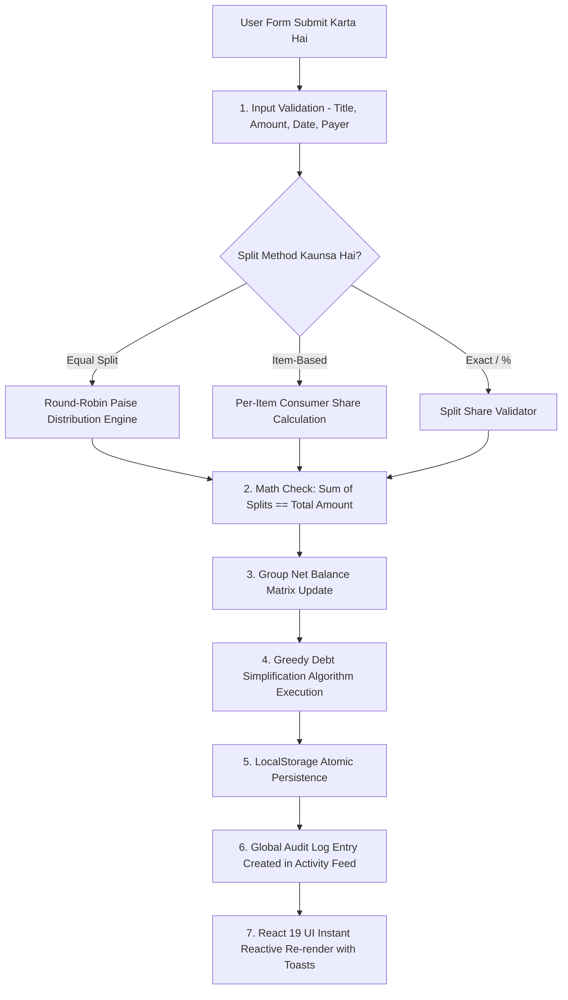

# 🎓 CampusSettle — Jury Presentation & Project Defense Guide (Hinglish Version)

> **Kiske Liye Hai:** College Jury, External Examiners, Hackathon Judges, and Viva Panel.  
> **Purpose:** Jury ke samne project ko confidently explain karna, real-world problems batana, internal math/algorithms samjhana aur live demo smoothly dena.

---

## 📌 Index / Table of Contents
1. [30-Second Opening Pitch (Jury ke samne bolne wala dialogue)](#1-30-second-opening-pitch)
2. [Real-World Problem: Yeh Project Kyu Banaya?](#2-real-world-problem-yeh-project-kyu-banaya)
3. [Internal Flow: "Jab User Expense Dalega Toh Code Kya Karega?"](#3-internal-flow-jab-user-expense-dalega-toh-kya-hoga)
4. [Click-by-Click Live Demo Script (Screen par kya dikhana hai aur kya bolna hai)](#4-click-by-click-live-demo-script)
5. [Algorithms & Mathematical Engine (Jury ko impress karne wali math)](#5-algorithms--mathematical-engine)
6. [CampusSettle vs Splitwise vs Excel (Comparison Table)](#6-comparison-table-humara-app-kyu-better-hai)
7. [Top 10 Tough Jury Questions & Killer Hinglish Answers (Viva Cheat-Sheet)](#7-top-10-tough-jury-questions--answers)

---

## 1. 30-Second Opening Pitch

> 💡 **Jaise hi Jury puche: "Tell us about your project" ya "Aapne kya banaya hai?", exact yeh dialogue bolna:**

```text
"Respected Sir / Ma'am,

Humne develop kiya hai CampusSettle — ek smart, student-centric expense sharing aur automated debt settlement web application.

Hostel students, roommates aur college friends me sabse common problem hoti hai shared bills split karna. Log WhatsApp groups ya manual diaries me hisaab rakhte hain jisse confusion, 1-paise ke rounding errors aur arguments hote hain. Aur Splitwise jaise existing apps ab basic features (jaise item-wise bills aur charts) ke liye heavy subscription fees charge karte hain.

CampusSettle is problem ko solve karta hai 3 main pillars se:
1. 100% Free Item-Based Dining Split — Jisme student sirf us cheez ke paise dega jo usne khayi hai.
2. Greedy Debt Simplification Algorithm — Jo group ke complex circular debts ko minimum possible UPI transactions me reduce kar deta hai.
3. Offline-First Real-Time Ledgers — Bina kisi server lag ke instant balance calculation aur visual charts provide karta hai."
```

---

## 2. Real-World Problem: Yeh Project Kyu Banaya?

Jury ko 3 real-world examples dekar samjhana:

### Problem 1: "Unfair Dining / Restaurant Split"
* **Scenario:** 4 dost restaurant gaye. 2 dosto ne sirf ₹300 ka simple Margherita Pizza khaya, aur 2 dosto ne ₹1,500 ke imported drinks aur starters order kiye.
* **Problem:** Agar total bill ₹1,800 equally divide hoga, toh vegetarian/non-drinkers ko zabardasti ₹450 dene padenge jo unke liye unfair hai.
* **CampusSettle Solution:** Humara **Itemized Split Wizard** student ko per-item select karne deta hai — yani Veg Pizza sirf pizza khane walo me divide hoga aur drinks sirf peene walo me.

### Problem 2: "1 Paise ka Rounding Error"
* **Scenario:** ₹100 ka bill 3 dosto me split karna hai. Calculator karega: `₹33.3333...`
* **Problem:** Agar sab ₹33.33 denge toh sum banta hai `₹99.99` — 1 paise gayab ho jata hai. Hundreds of bills ke baad accounts out of sync ho jate hain.
* **CampusSettle Solution:** Humara **Round-Robin Paise Engine** remainder 1 paise ko pehle user ko assign karke guarantee karta hai ki `₹33.34 + ₹33.33 + ₹33.33 = Exact ₹100.00`.

### Problem 3: "Circular Debt Mess (Too Many Transactions)"
* **Scenario:** 
  - Rahul ne Priya ko ₹500 diye.
  - Priya ne Amit ko ₹500 diye.
  - Amit ne Rahul ko ₹200 diye.
* **Problem:** Sab log ek dusre ko alag-alag 3 baar GooglePay/PhonePe karenge.
* **CampusSettle Solution:** Humara **Greedy Debt Simplifier** mathematically calculate karke bata deta hai ki **Amit direct Priya ko ₹300 transfer karega**, aur sabka account 1 single transaction me zero ho jayega!

---

## 3. Internal Flow: "Jab User Expense Dalega Toh Kya Hoga?"

> 🧠 **Jury Question: "Expense dalne par internal flow kya hota hai? Code ke andar data kaise process hota hai?"**



### 🔍 Code Level Explanation (Step-by-Step):

1. **Step 1: Input Validation (`validation.js`)**
   - System check karta hai ki bill ka title khali na ho, amount positive ho (`> 0`), date valid ho, aur bill pay karne wala group ka valid member ho.

2. **Step 2: Split Math Execution (`splitCalculator.js`)**
   - **Equal Split:** Base share nikalta hai: `Math.floor((Amount / N) * 100) / 100`. Remainder paise ko round-robin distribute karta hai.
   - **Item-Based Split:** Har dish ki price ko uske specific consumers ke count se divide karke user-wise sum karta hai.
   - **Split Validator:** Verify karta hai ki `|Total Amount - Sum(User Shares)| < 0.01`. Agar match nahi hota toh form submit nahi hone deta.

3. **Step 3: Pairwise Balance Matrix Re-computation (`balanceCalculator.js`)**
   - Har member ka **Net Balance** calculate hota hai:
     $$\text{Net Balance} = \text{Total Amount Paid by User} - \text{Total Share Consumed by User}$$
   - Agar value positive hai $\rightarrow$ User ko paise wapas milenge (Green).
   - Agar value negative hai $\rightarrow$ User ko paise dene hain (Red).

4. **Step 4: Greedy Debt Simplification Algorithm (`settlementCalculator.js`)**
   - Group ke sabhi debtors (jinhone paise dene hain) aur creditors (jinhe paise milne hain) ko sort karta hai.
   - Largest debtor ko largest creditor ke saath match karke minimum transaction generate karta hai.

5. **Step 5: Audit Log & LocalStorage Write (`activityService.js` + `storage.js`)**
   - Global activity log me event store hota hai: *"Bharat added expense 'Dinner' of ₹3,000 in 'Goa Trip'"*.
   - Encrypted/safe `try-catch` serializer local storage ko update karta hai.

6. **Step 6: Real-time UI Update**
   - React 19 reactive hooks se Dashboard ke StatCards, Net Balance, Recharts Spending Graphs aur Group Ledgers bina page reload kiye instant update ho jate hain.

---

## 4. Click-by-Click Live Demo Script

Jury ke samne 5-minute ka live demo aise execute karein:

### Step 1: Login & Interface Walkthrough (1 Min)
1. Browser me [http://localhost:5173/login](http://localhost:5173/login) open karein.
2. **Jury ko bolna:**  
   *"Sir, yeh humara login portal hai jisme humne official CampusSettle branding, dynamic gradient backdrop aur interactive Eye/EyeOff password toggle implement kiya hai."*
3. **Demo credentials dalein:**
   - **Email:** `bharat@campussettle.com`
   - **Password:** `password123` (Eye icon click karke toggle karke dikhayein).
4. Click **Sign In** $\rightarrow$ Success toast aayega.

---

### Step 2: Dashboard & Analytics Overview (1 Min)
1. **4 Main StatCards explain karein:**
   - **Total Spent:** User ne total kitna spend kiya.
   - **You Are Owed (Green):** Dosto se kitne paise lene hain.
   - **You Owe (Red):** Dosto ko kitne paise dene hain.
   - **Net Balance:** Overall financial situation (profit me ho ya debt me).
2. **Recharts Visual Graphs dikhayein:**
   - Bar chart: Monthly spending history.
   - Donut chart: Category-wise breakdown (Food, Travel, Hostel, Bills).

---

### Step 3: Real-World Itemized Expense Add Karna (2 Mins — Hero Feature)
1. Click karein **"Add Expense"** button.
2. **Step 1 (Bill Details):**
   - Group: *"Goa Trip 2026"*
   - Title: *"Dinner at Fisherman's Wharf"*
   - Amount: `₹3000`
   - Category: *"Food & Dining"*
   - Paid By: *"Bharat Rathor"*
   - Click **Next**.
3. **Step 2 (Items):**
   - Dish 1: *"Seafood Platter"* — `₹2000` (Tick karein: Bharat aur Devansh).
   - Dish 2: *"Veg Pasta & Garlic Bread"* — `₹1000` (Tick karein: Jainam aur Manan).
   - **Jury ko point out karein:** *"Sir, dekhiye vegetarian dosto par seafood ka koi charge nahi laga!"*
4. **Step 3 & 4 (Split Method & Review):**
   - Split Validator dikhayein jo verify kar raha hai ki `₹2000 + ₹1000 = Exact ₹3000`.
5. **Step 5 (Preview & Save):**
   - Click **Save Expense** $\rightarrow$ Instant toast aur balance update!

---

### Step 4: Debt Simplification & Settle Up Magic (1 Min)
1. **Groups** page par jayein $\rightarrow$ Open **"Goa Trip 2026"**.
2. **"Settlement Plan" Tab** open karein:
   - **Jury ko bolna:** *"Sir, normally 4 dosto ke beech 6 alag-alag transactions hote. Lekin humare Greedy Algorithm ne isko simplify karke sirf 2 direct payments me convert kar diya."*
3. Click **"Settle Up"** $\rightarrow$ Payment mode (UPI / Cash) select karein $\rightarrow$ Balance zero ho jayega!
4. **Activity Tab** open karke dikhayein ki har single action ka audit log timestamp ke saath maintain hota hai.

---

## 5. Algorithms & Mathematical Engine

### A. The Greedy Debt Simplification Algorithm
* **Time Complexity:** $\mathcal{O}(N \log N)$ (jaha $N$ = group members).
* **Kaise Kaam Karta Hai:**
  1. Har member ka net balance $B[u]$ nikalte hain.
  2. Do lists banate hain:
     - $\text{Debtors (Paise dene wale)} = \{ (u, -B[u]) \mid B[u] < 0 \}$ (Descending sorted).
     - $\text{Creditors (Paise lene wale)} = \{ (u, B[u]) \mid B[u] > 0 \}$ (Descending sorted).
  3. Jab tak dono list empty nahi hoti:
     - Sabse bada debtor $D$ aur sabse bada creditor $C$ nikalte hain.
     - Settle amount $X = \min(D.\text{amount}, C.\text{amount})$ transfer karte hain.
     - Result: **"$D$ pays $C$ ₹$X$"**.
     - Bacha hua balance wapas list me push kar dete hain.

### B. Round-Robin Fractional Cent Algorithm
$$\text{Base} = \lfloor \frac{\text{Total}}{N} \times 100 \rfloor / 100, \quad \text{Remainder } R = (\text{Total} \times 100) \pmod N$$
* Remainder ke $R$ paise pehle $R$ members me 1-1 paise karke add ho jate hain. Isse exact ₹0.00 drift rehti hai.

---

## 6. Comparison Table: Humara App Kyu Better Hai?

| Feature | CampusSettle (Humara Project) | Splitwise | Excel / WhatsApp |
| :--- | :---: | :---: | :---: |
| **Itemized Dining Split** | ✅ **100% Free & Built-in** | ❌ Paid Subscription ($39.99/yr) | ❌ Manual calculator math |
| **Paise Rounding Engine** | ✅ **Guaranteed ₹0.00 loss** | ⚠️ Rounding approximation | ❌ ₹1 ke jhagde |
| **Greedy Debt Minimizer** | ✅ **Automated $\mathcal{O}(N \log N)$** | ⚠️ Free tier par limited | ❌ Impossible manually |
| **Privacy & Local Storage** | ✅ **100% Client Data Safe** | ❌ Data tracking / Ads | ⚠️ Scattered messages |
| **UI Aesthetics** | ✅ **Tailwind v4 + Glassmorphism** | ❌ Old legacy design | ❌ Boring grid |
| **Multi-Currency (₹, $, €, £)** | ✅ **Instant Global Toggle** | ⚠️ Complex settings | ❌ None |

---

## 7. Top 10 Tough Jury Questions & Answers

### Q1: "Aapne backend database (MySQL/MongoDB) ki jagah LocalStorage kyu use kiya?"
> **Answer:**  
> *"Sir, humne isse **Offline-First Architecture** ke roop me design kiya hai. College students aksar aisi jagah travel karte hain (jaise Goa beaches ya hill stations) jaha internet weak hota hai. LocalStorage se app zero network lag ke saath 100% offline chalta hai. Aur humara code clean service-layer architecture (`groupService`, `expenseService`) par bana hai, isliye backend API connect karna sirf 1 line of code ka change hai."*

### Q2: "Financial calculations me floating-point inaccuracies (e.g. 0.1 + 0.2 = 0.30000000000000004) kaise handle ki?"
> **Answer:**  
> *"Sir, hum direct decimal floating math perform nahi karte. `splitCalculator.js` me amounts ko integer paise (cents) me multiply karke quotient aur remainder nikalte hain, aur validation ke liye epsilon tolerance check (`Math.abs(total - sum) < 0.01`) lagaya hai."*

### Q3: "Greedy algorithm ka actual mathematical proof kya hai?"
> **Answer:**  
> *"Sir, agar ek group me $N$ members hain, toh worst-case me $\frac{N(N-1)}{2}$ transactions ho sakti hain. Greedy algorithm har step par at least ek user ka net balance exactly zero kar deta hai, jisse total transactions maximum $N-1$ me shrink ho jati hain."*

### Q4: "Agar koi member group chhod ke jana chahe aur uska hisaab pending ho toh?"
> **Answer:**  
> *"Humare `memberService.delete()` me data integrity guard laga hai. Agar member ka koi pending balance ya active expense participation hai, toh system deletion block kar deta hai taaki financial audit trail break na ho."*

### Q5: "Add Member modal me search kaise kaam karta hai?"
> **Answer:**  
> *"Humne `AddMemberModal.jsx` me **300ms Debounced Search** implement kiya hai. Jab user type karta hai, har keystroke par state churn nahi hota; 300ms pause ke baad search execute hota hai aur already present members par 'In Group' ka badge dikha deta hai."*

### Q6: "Custom category ka option kyu diya?"
> **Answer:**  
> *"Standard categories (Food, Travel, Bills) ke alawa college students ke specific kharche hote hain jaise 'Project Hardware Components' ya 'Hostel Fest Decor'. Jab user 'Other' select karta hai toh dedicated custom category input trigger hota hai."*

### Q7: "Authentication me security kaise ensure ki hai?"
> **Answer:**  
> *"Humne regex-based client validation lagaya hai — 10-digit phone number, strict email format, minimum 8-character password. Aur native browser password reveal overlays ko disable kiya hai taaki UI collision na ho."*

### Q8: "Expenses page par pagination kyu lagayi?"
> **Answer:**  
> *"Jab group me 100+ expenses ho jate hain, toh DOM overload hone lagta hai. Humne 9 items per page ka clean paginator implement kiya hai jo filters badalne par auto-reset ho jata hai."*

### Q9: "Tech Stack me kaunse modern tools use kiye hain?"
> **Answer:**  
> *"Humne use kiya hai **React 19**, **Vite 8**, **Tailwind CSS v4** (with `@tailwindcss/vite`), **Recharts** for SVG data visualization, **Framer Motion** for smooth spring physics transitions, and **Lucide React** for icons."*

### Q10: "CampusSettle ka future roadmap kya hai?"
> **Answer:**  
> *"1. Real-time UPI Deep Linking (`upi://pay?pa=...`) taaki settle up par click karte hi GPay/PhonePe open ho jaye.  
> 2. OCR Bill Scanning using Tesseract.js jisse restaurant bill ki photo kheench kar automatically line items extract ho sakein.  
> 3. Multi-device sync via WebSockets."*

---

### 🏆 Presentation ke liye Golden Rules:
1. **Confidence:** Smile karein aur clear aawaz me bolein.
2. **Key Highlight:** **Itemized Split** aur **Greedy Debt Simplification** par sabse zyada focus karein — yahi aapke project ki sabse badi USP (Unique Selling Proposition) hai.
3. **Data Pre-loaded:** Browser me `http://localhost:5173` par pehle se login karke rakhein taaki demo me 1 second bhi waste na ho. All the best! 🚀
