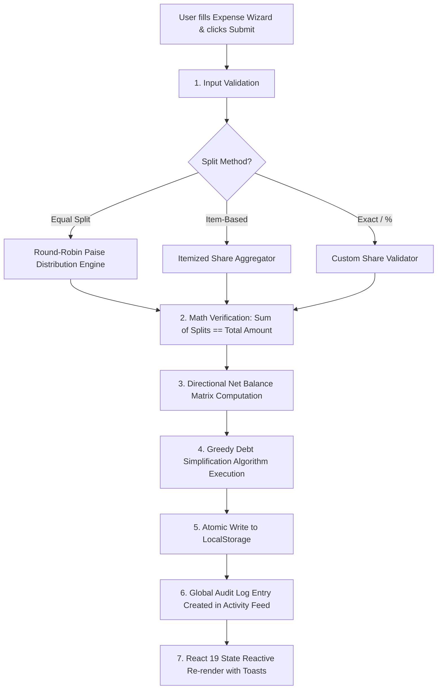

# 🎓 CampusSettle — Complete Jury Presentation & Project Defense Guide

> **Target Audience:** College Jury, External Examiners, Hackathon Judges, and Viva Panels.  
> **Core Theme:** Real-world problem, financial algorithmic innovation, live demo walkthrough, and technical Q&A defense.

---

## 📌 Index / Table of Contents
1. [30-Second Killer Elevator Pitch (Starting Speech)](#1-30-second-killer-elevator-pitch)
2. [Real-World Problem: Why CampusSettle?](#2-real-world-problem-why-campussettle)
3. [Deep Dive: "When a User Adds an Expense, What Happens Behind the Scenes?"](#3-what-happens-behind-the-scenes-when-an-expense-is-added)
4. [Click-by-Click Live Demo Script for Jury](#4-click-by-click-live-demo-script-for-jury)
5. [Algorithmic Innovations (The Math to Impress Jury)](#5-algorithmic-innovations-the-math)
6. [CampusSettle vs. Splitwise vs. Excel (Comparison Matrix)](#6-competitive-advantage-matrix)
7. [Top 10 Tough Jury Questions & Killer Answers (Q&A Defense)](#7-top-10-tough-jury-questions--answers)

---

## 1. 30-Second Killer Elevator Pitch

> 💡 **Speak with confidence. Here is your opening dialogue when the jury asks "What have you built?":**

```text
"Good morning / afternoon Respected Jury members. 

We have built CampusSettle — a smart, student-centric expense sharing and automated debt settlement web application. 

In college hostels, trips, and shared apartments, students constantly struggle with messy WhatsApp notes, rounding discrepancies in split bills, and awkward money reminders. Existing apps like Splitwise now hide basic features like itemized splits and charts behind expensive paywalls.

CampusSettle solves this with:
1. 100% Free Item-based dining splits (users only pay for what they ate).
2. A Greedy Debt Simplification Algorithm that reduces circular group debts into the minimum possible UPI transactions.
3. Real-time balance ledgers, analytics, and audit logs with zero external server dependencies."
```

---

## 2. Real-World Problem: Why CampusSettle?

### ❌ The Real-World Problems Students Face Every Day:
1. **The "Unfair Pizza & Dining Split"**:
   - 4 roommates go out for dinner. 2 order a simple Margherita pizza (₹300), while 2 order imported drinks & steak (₹1,500).
   - In traditional apps, the bill gets divided equally, forcing non-consumers to overpay.
   - **CampusSettle Solution:** Line-item selection where each item is only split among consumers of that item.

2. **The "1 Paise Rounding Error" Conflict**:
   - ₹100 split 3 ways on a calculator gives ₹33.3333...
   - If 3 people pay ₹33.33, the total is ₹99.99 (₹0.01 missing). Over hundreds of bills, ledgers go out of sync.
   - **CampusSettle Solution:** Custom Round-Robin Paise Distribution algorithm that distributes fractional remainder cents so sum of debts strictly equals the total bill amount.

3. **The "Circular Debt Mess" (Too Many Transactions)**:
   - Rahul owes Priya ₹500.
   - Priya owes Amit ₹500.
   - Amit owes Rahul ₹200.
   - Instead of making 3 separate bank transfers, **CampusSettle's Greedy Debt Simplifier** calculates that **Amit simply pays Priya ₹300**, reducing 3 transactions to just 1!

---

## 3. What Happens Behind the Scenes When an Expense is Added?

> 🧠 **When Jury asks: "Expense dalne par internal flow kya hota hai? Code kya karta hai?":**



### Detailed 6-Step Execution Breakdown:

1. **Step 1: Input Validation (`validation.js`)**:
   - Validates that bill title is non-empty, date is valid, and total amount is $> 0$.
   - Validates that the payer exists in the group's active member directory.

2. **Step 2: Split Math Calculation (`splitCalculator.js`)**:
   - If **Equal Split**: 
     $$\text{Base Share} = \lfloor \frac{\text{Total}}{N} \times 100 \rfloor / 100$$
     The remainder cents ($R = \text{Total} - (\text{Base} \times N)$) are added 1 paise at a time to the first $R$ members.
   - If **Item-Based Split**: 
     Calculates each item's price divided by the participants selected for that specific item, then sums up per user.

3. **Step 3: Pairwise Balance Ledger Calculation (`balanceCalculator.js`)**:
   - Computes each member's **Net Balance**:
     $$\text{Net Balance}_i = \text{Total Paid by } i - \text{Total Consumed Share of } i$$
   - Updates the group debt matrix: positive balance means you get money back; negative balance means you owe money.

4. **Step 4: Greedy Settlement Optimization (`settlementCalculator.js`)**:
   - Identifies all net debtors (people with negative balances) and net creditors (positive balances).
   - Pairs the biggest debtor with the biggest creditor and transfers $\min(|\text{Debtor}|, |\text{Creditor}|)$.
   - Repeats iteratively until all balances reach exact ₹0.00.

5. **Step 5: Audit Activity Generation (`activityService.js`)**:
   - Automatically generates an immutable audit entry (e.g., *"Bharat added expense 'Goa Beach Shack' of ₹4,200 in 'Goa Trip' group"*).

6. **Step 6: UI Update**:
   - State reactive hooks update Dashboard metrics, StatCards, Recharts spending charts, and group breakdown instantly without reloading.

---

## 4. Click-by-Click Live Demo Script for Jury

Follow this sequence during your 5-minute presentation:

### Act 1: Login & The Clean Interface (1 Min)
1. **Show the Login Screen ([Login.jsx](file:///f:/silver-oak/myapp/src/pages/Login.jsx))**:
   - *Say to Jury:* *"Sir/Ma'am, notice our responsive interface with the official CampusSettle logo and modern styling. We have integrated interactive password visibility toggles with full validation."*
2. **Log in**:
   - Email: `bharat@campussettle.com` | Password: `password123`
   - Click **Sign In** $\rightarrow$ show the success toast.

---

### Act 2: Dashboard & Financial Overview (1 Min)
1. **Explain the 4 StatCards ([Dashboard.jsx](file:///f:/silver-oak/myapp/src/pages/Dashboard.jsx))**:
   - **Total Spent**: Total money spent across all groups.
   - **You Are Owed (Green)**: Total money friends owe you.
   - **You Owe (Red)**: Total money you need to pay back.
   - **Net Balance**: Overall financial standing with adaptive styling.
2. **Show Analytics Charts ([SpendingChart.jsx](file:///f:/silver-oak/myapp/src/components/dashboard/SpendingChart.jsx))**:
   - Point to the **Monthly Spending Trend Bar Chart** and **Category Donut Chart** powered by Recharts.

---

### Act 3: Adding a Real-World Expense (2 Mins — The "Star Feature")
1. Click **Add Expense** in Navbar or Dashboard.
2. **Step 1: Bill Details**:
   - Group: *"Goa Trip 2026"*
   - Title: *"Dinner at Fisherman's Wharf"*
   - Amount: `₹3,000`
   - Category: *"Food & Dining"*
   - Paid By: *"Bharat Rathor"*
   - Click **Next**.
3. **Step 2: Line Items (Itemized Split)**:
   - Add Item 1: *"Seafood Platter"* — `₹2,000` (Assigned to: Bharat, Devansh).
   - Add Item 2: *"Vegetarian Pasta"* — `₹1,000` (Assigned to: Jainam, Manan).
   - *Point out to Jury:* *"See how easy it is to ensure vegetarians don't pay for seafood!"*
4. **Step 3 & 4: Split Method & Summary**:
   - Show how the Split Validator checks line totals against ₹3,000.
5. **Step 5: Preview & Save**:
   - Click **Save Expense** $\rightarrow$ Show instant confirmation toast.

---

### Act 4: The Debt Simplification Magic (1 Min)
1. Navigate to **Groups** $\rightarrow$ Open **"Goa Trip 2026"**.
2. Switch to **Settlement Plan Tab**:
   - Show the Jury: *"Instead of 6 people sending multiple UPI transfers back and forth, CampusSettle has simplified the entire group debt into just 2 direct settlements."*
3. Click **Settle Up** $\rightarrow$ Record payment mode (UPI / Cash) $\rightarrow$ Balances update to zero in real-time.

---

## 5. Algorithmic Innovations (The Math)

### A. The Greedy Debt Simplification Algorithm
* **Time Complexity:** $\mathcal{O}(N \log N)$ where $N$ is the number of members in the group.
* **Algorithm Steps:**
  1. Calculate net balance $B[u]$ for every user $u$.
  2. Separate into two max-heaps (priority lists):
     - $\text{Debtors} = \{ (u, -B[u]) \mid B[u] < 0 \}$ (sorted descending)
     - $\text{Creditors} = \{ (u, B[u]) \mid B[u] > 0 \}$ (sorted descending)
  3. While both lists are non-empty:
     - Pop max debtor $D$ and max creditor $C$.
     - Settle amount $X = \min(D.\text{amount}, C.\text{amount})$.
     - Output settlement: **$D$ pays $C$ ₹$X$**.
     - If remaining debt exists, push back into respective heap.

---

## 6. Competitive Advantage Matrix

| Feature | CampusSettle (Our App) | Splitwise | Excel / WhatsApp |
| :--- | :---: | :---: | :---: |
| **Itemized Dining Split** | ✅ **100% Free & Built-in** | ❌ Paywalled (Pro feature) | ❌ Manual calculator math |
| **Paise Rounding Engine** | ✅ **Guaranteed ₹0.00 drift** | ⚠️ Approximated | ❌ Creates ₹1 disputes |
| **Debt Simplification** | ✅ **Greedy Algorithm** | ⚠️ Restricted free limit | ❌ Impossible manually |
| **Privacy & Local Storage** | ✅ **100% Client-Side Safe** | ❌ Sells data / Ads | ⚠️ Scattered messages |
| **Student UX & Dark Cards** | ✅ **Tailwind v4 Glassmorphism** | ❌ Generic legacy UI | ❌ Plain spreadsheet |
| **Multi-Currency Toggle** | ✅ **Instant (₹, $, €, £)** | ⚠️ Complex settings | ❌ None |

---

## 7. Top 10 Tough Jury Questions & Answers

### Q1: "Why did you use LocalStorage instead of a MySQL/MongoDB backend?"
> **Answer:**  
> *"CampusSettle is engineered as an **Offline-First Progressive Architecture**. College students frequently travel to areas with poor connectivity (like mountains or remote beaches on college trips). LocalStorage with our wrapped `storage.js` serialization layer allows 100% uptime with zero network lag. Furthermore, our service layer architecture (`groupService`, `expenseService`) is decoupled so connecting a MongoDB/PostgreSQL REST API is just a 1-line swap in the services."*

### Q2: "How do you handle floating point inaccuracies (e.g. 0.1 + 0.2 != 0.3) in financial math?"
> **Answer:**  
> *"We do not perform split operations on raw floats directly. Our `splitCalculator.js` converts numbers to integer paise (cents), computes integer quotients and remainders, and uses an epsilon comparison tolerance threshold (`|Total - Sum| < 0.01`)."*

### Q3: "What algorithm do you use to settle debts with minimum transactions?"
> **Answer:**  
> *"We implemented a **Greedy Debt Simplification Algorithm** in `settlementCalculator.js`. It sorts net debtors and net creditors in descending magnitude and greedily matches the largest debtor with the largest creditor. This reduces the number of transactions from $\mathcal{O}(N^2)$ down to at most $N-1$."*

### Q4: "Can a member be deleted if they still owe money or paid for a bill?"
> **Answer:**  
> *"No. In `memberService.delete()`, we have integrity guards that verify if the member has active splits or expenses in the group. If they do, the system rejects deletion to protect audit and historical ledger integrity."*

### Q5: "How is security handled during signup/login?"
> **Answer:**  
> *"We enforce strict client-side validation rules in `validation.js` — 10-digit Indian phone numbers, RFC-compliant email schemas, minimum 8-character password strength, and confirm-password matching. We have also disabled browser-injected credentials and reveal artifacts to prevent UI overlay collisions."*

### Q6: "How does your debounce search work when adding members?"
> **Answer:**  
> *"In `AddMemberModal.jsx`, we use a `300ms` `useEffect` timer. When the user types a friend's name or email, it delays search filtering until typing pauses, preventing unnecessary state churn and rendering registered user cards instantly with 'In Group' indicators."*

### Q7: "What happens if 3 roommates split ₹1,000 equally?"
> **Answer:**  
> *"₹1,000 / 3 = ₹333.33 each with ₹0.01 remainder. Our round-robin engine assigns ₹333.34 to Roommate 1, ₹333.33 to Roommate 2, and ₹333.33 to Roommate 3. Total sum is exact ₹1,000.00."*

### Q8: "What happens if a user enters a custom category not in the dropdown?"
> **Answer:**  
> *"When selecting 'Other' in the category dropdown, our `BillDetails.jsx` dynamic component renders a dedicated 'Custom Category Name' input, which is mapped directly into the expense payload."*

### Q9: "What UI framework and styling approach did you use?"
> **Answer:**  
> *"We used **React 19** with **Vite 8** and **Tailwind CSS v4** with `@tailwindcss/vite`. For animations, we used **Framer Motion**, and for vector graphics and charts, we used **Lucide React** and **Recharts**."*

### Q10: "What is your future roadmap for CampusSettle?"
> **Answer:**  
> *"1. Real-time UPI Deep Links (`upi://pay?pa=...`) for 1-tap GooglePay/PhonePe payments.  
> 2. OCR Optical Receipt Scanning using Tesseract.js to automatically convert camera photos of restaurant bills into itemized line items.  
> 3. Cloud synchronization with WebSockets for instant multi-device push notifications."*

---

### 🏁 Final Tips for Your Presentation:
- 🎙️ **Tone:** Polite, energetic, and confident.
- 🎯 **Focus:** Emphasize **Itemized Split** and **Greedy Debt Simplification** — this is where other students usually fail and where CampusSettle shines.
- 💻 **Live Demo:** Keep sample data pre-loaded so you can demonstrate features within seconds. Good luck! 🚀
