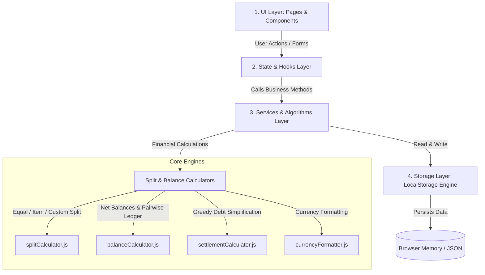
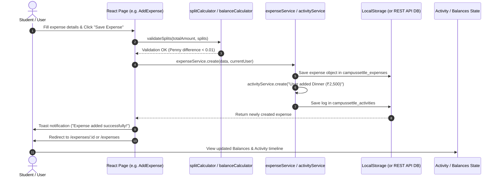
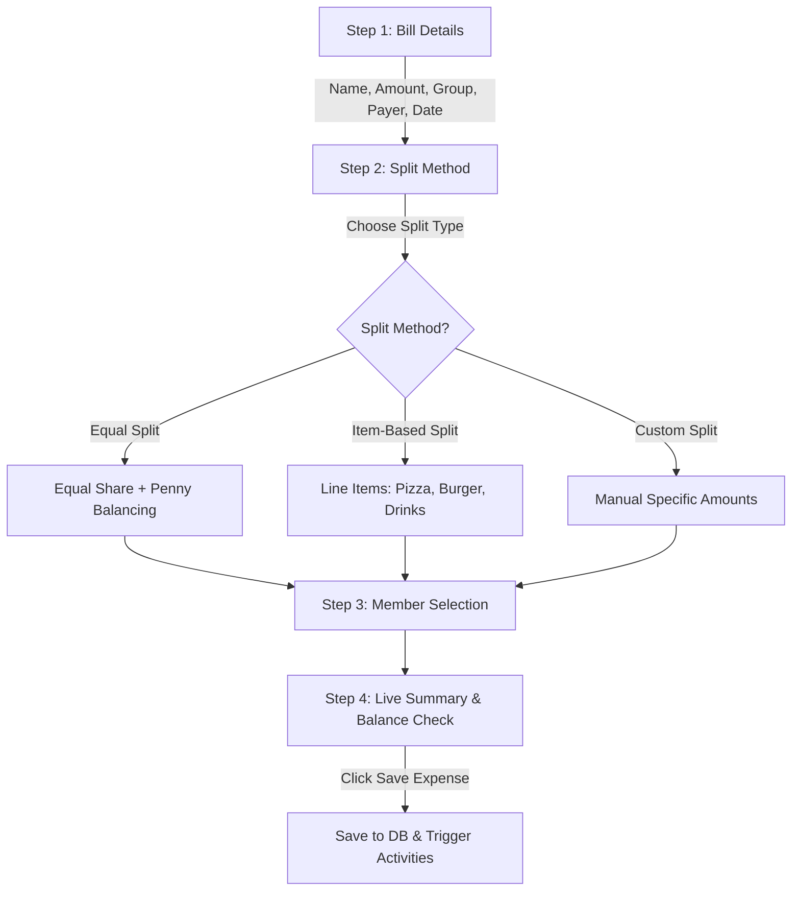

# CampusSettle — Complete Project Architecture & Working Guide (Hinglish + English)

Yeh document **CampusSettle** project ka complete step-by-step operational guide hai. Isme system ka **Architecture**, **Data Flow**, aur website ke har page par **"Kahan click karne se kya hota hai"** (Click-by-Click User Journeys) bilkul detail me explain kiya gaya hai.

---

## 1. High-Level Architecture (System Design)

CampusSettle ek modern, fast, client-side financial application hai jo React, Tailwind CSS, aur Browser LocalStorage par chalti hai. Iska architecture 4 main layers me divided hai:

### Layer Breakdown:
1. **UI Layer (`src/pages/` & `src/components/`)**:
   - Clean, reactive components jo user se input lete hain aur visual output (charts, badges, cards, modals) display karte hain.
2. **State & Routing Layer (`src/App.jsx`, `react-router-dom`)**:
   - Single-page routing with protected route guards (`/dashboard`, `/groups`, `/expenses`, `/balances`, `/settlements`, etc.).
3. **Services Layer (`src/services/`)**:
   - Independent service modules (`groupService`, `expenseService`, `paymentService`, `userService`, `activityService`). Yeh directly UI ko data source se decouple karte hain.
4. **Calculators & Math Engine (`src/utils/`)**:
   - Pure mathematical functions jo financial calculations (penny balancing, pairwise debts, debt simplification graph algorithm) execute karte hain.
5. **Storage Layer (`src/utils/storage.js`)**:
   - Safe serialization/deserialization wrapper jo browser crash hone par data corrupt hone se bachata hai.

---

## 2. Complete Data Flow Diagram (Data Kaise Flow Hota Hai)

Jab bhi user koi action karta hai (jaise Add Expense ya Settle Payment), data flow is tarah execute hota hai:

---

## 3. Har Page Ka Step-by-Step Working & Click Actions (Click-by-Click Guide)

---

### 🟢 Page 1: Authentication (Login & Signup)
* **Routes**: `/login`, `/signup`
* **Files**: `src/pages/Login.jsx`, `src/pages/Signup.jsx`, `src/services/userService.js`

#### A. Jab User Login Karta Hai:
1. **Input Fill Karna**:
   - User email (`bharat@campussettle.com`) aur password (`password123`) enter karta hai.
2. **Demo Quick-Fill Buttons Par Click**:
   - Form ke niche quick login chips hain: `Bharat (Admin)`, `Aman`, `Priya`, `Neha`.
   - Kisi bhi chip par click karne se email aur password automatically inputs me fill ho jate hain.
3. **"Sign In" Button Par Click**:
   - `userService.login(email, password)` call hota hai.
   - Validation check hoti hai: Kya user exist karta hai aur password match hota hai?
   - **Success**: `campussettle_current_user` storage key me user session save hota hai, `toast.success("Welcome back, Bharat!")` show hota hai, aur user directly `/dashboard` par navigate ho jata hai.
   - **Error**: Agar wrong credentials hain toh red error alert aata hai: `"Invalid email or password"`.

#### B. Jab User Signup Karta Hai:
1. Form me `Full Name`, `College Name` (e.g., *Silver Oak University*), `Email`, aur `Password` daalta hai.
2. "Create Account" click karne par unique email check hota hai.
3. User create hone ke baad auto-login hota hai aur `/dashboard` redirect ho jata hai.

---

### 🟢 Page 2: Dashboard Overview
* **Route**: `/dashboard`
* **File**: `src/pages/Dashboard.jsx`

#### Jab User Dashboard Par Aata Hai:
1. **Net Balance Banner**:
   - Top banner calculate karta hai: Total Kitna Paana Hai (`You are owed`) vs Total Kitna Dena Hai (`You owe`).
   - Agar net positive hai toh green badge ("You are owed ₹X"), negative hai toh red badge show hota hai.
2. **Top 3 Action Buttons**:
   - **"+ Add Expense" Click**: Direct `/expenses/add` wizard page open hota hai.
   - **"+ Create Group" Click**: Modal popup open hota hai naya group banane ke liye.
   - **"Settle Debt" Click**: Direct `/settlements` page open hota hai jahan pending dues dikhte hain.
3. **Interactive Spending Analytics (Recharts)**:
   - **Monthly Bar Chart**: Last 6 months me monthly expense trend show karta hai. Bars par hover karne se tooltip open hota hai.
   - **Category Donut Chart**: Food, Travel, Bills, etc. ka percentage split dikhata hai.
4. **Recent Expenses & Activity List**:
   - Har expense card par click karne se us particular expense ka details page (`/expenses/:id`) open ho jata hai.

---

### 🟢 Page 3: Groups Management (`/groups` & `/groups/:id`)
* **Files**: `src/pages/Groups.jsx`, `src/pages/GroupDetails.jsx`, `src/services/groupService.js`, `src/services/memberService.js`

#### A. Naya Group Banana (`/groups`):
1. User top right me **"+ Create Group"** button par click karta hai.
2. Screen par **Create Group Modal** open hota hai:
   - **Group Name**: e.g., "Manali Trip", "Flat 402".
   - **Category Select**: Travel, Hostel, Food, Event, Project, Other.
   - **Description**: Short details.
3. **"Create Group" Submit Click**:
   - `groupService.create()` call hota hai.
   - Current user automatically is group ka **Admin** ban jata hai.
   - `activityService` me activity add hoti hai: `"Bharat created the group 'Manali Trip'"`.
   - Modal band ho jata hai aur naya group card list me visually appear ho jata hai.

#### B. Group Details Page (`/groups/:id`):
1. **Group Card Click**: User kisi bhi group card par click karta hai toh us group ka detailed dashboard open hota hai.
2. **Top Header**: Group ka title, category badge, aur total group spending dikhti hai.
3. **"Add Member" Button Click**:
   - Popup open hota hai: Name aur Email maangta hai.
   - User details daal kar **"Add Member"** click karta hai.
   - Duplicate check: Agar woh email already group me hai toh alert deta hai: *"A member with this email already exists"*.
   - Success hone par member list me add ho jata hai aur further expenses me select hone lagta hai.
4. **Tabs Switching**:
   - **Expenses Tab**: Group ke saare bills date-wise dikhte hain.
   - **Balances Tab**: Group ke members ke aapas ke dues ("Who owes whom") dikhte hain.
   - **Members Tab**: List of members with their roles (`Admin` / `Member`) aur remove button.

---

### 🟢 Page 4: Add Expense Wizard (Step-by-Step Bill Splitting)
* **Route**: `/expenses/add`
* **File**: `src/pages/AddExpense.jsx`, `src/components/expenses/ExpenseWizard.jsx`

Yeh project ka sabse important feature hai jahan heavy financial algorithms execute hote hain.

#### Step 1: Bill Information
1. **Expense Title**: e.g., *"Dinner at Fisherman Wharf"*.
2. **Total Amount**: e.g., `₹2,500.00`.
3. **Select Group**: Dropdown se group choose karte hain (e.g. *Goa Trip*). Group select hote hi group ke saare members automatically fetch ho jate hain.
4. **Paid By**: Dropdown se select karte hain ki kisne paise pay kiye (e.g. *Bharat*).
5. **Category**: Food, Travel, Bills, etc.
6. **"Next Step" Click**: Step 2 open hota hai.

#### Step 2: Split Method Selection
User ke paas 3 options hain:
- **Option A: Equal Split (Sab me barabar)**
  - Formula: `Total Amount / Number of selected members`.
  - Penny / Paise Balancing: Agar ₹100 ko 3 logo me baanta jaye (100 / 3 = 33.3333...), toh `splitCalculator.js` remainder paise ko distribute karke total exact ₹100.00 banata hai (33.34, 33.33, 33.33). Sum hamesha 100% match hota hai!
- **Option B: Item-Based Split (Student Bill Splitting)**
  - Har student sirf us cheez ke paise deta hai jo usne consume ki!
  - User line-items add karta hai:
    - Item 1: "Pizza" (₹800) -> Selects Bharat, Aman, Priya.
    - Item 2: "Pasta" (₹600) -> Selects Bharat, Priya.
    - Item 3: "Drinks" (₹400) -> Selects Aman, Neha.
  - Har item ka share calculate hoke automatically individual student ke total me jud jata hai.
- **Option C: Custom Split (Specific Amounts)**
  - User directly kisi ka bhi amount manually input kar sakta hai.
  - Live difference indicator dikhta hai: *"Remaining: ₹0.00"* green tick ke sath.

#### Step 3: Confirmation & Save
- User **"Save Expense"** click karta hai.
- `expenseService.create()` call hota hai:
  - Bill create hota hai.
  - Sabhi participants ke debt shares store hote hain.
  - `activityService` me notification log create hota hai.
- User expense details page par navigate ho jata hai.

---

### 🟢 Page 5: Balances & Who-Owes-Whom (`/balances`)
* **Route**: `/balances`
* **Files**: `src/pages/Balances.jsx`, `src/utils/balanceCalculator.js`

#### Yeh Page Kaise Kaam Karta Hai:
1. **Net Balance Calculation**:
   - Har member ke dwara total pay kiya gaya amount (`totalPaid`) aur unka total hissa (`totalShare`) calculate hota hai.
   - `Net Balance = totalPaid - totalShare`.
   - Positive (+): Member paise lega (Creditor).
   - Negative (-): Member paise dega (Debtor).
2. **Pairwise Ledger (Aapas ka Hisaab)**:
   - Example: *"Aman owes Bharat ₹450.00"*, *"Priya owes Bharat ₹600.00"*.
3. **"View Breakdown" Accordion Par Click**:
   - Click karne par accordion expand hota hai aur itemized history dikhata hai ki yeh ₹450 kin-kin bills (e.g. Pizza, Cab, WiFi) ki wajah se owe ho rahe hain!
4. **"Settle" Button Par Click**:
   - Direct Settle Modal open hota hai jisme payer, receiver aur exact amount pre-filled hoti hai!

---

### 🟢 Page 6: Debt Settlements & Smart Optimizer (`/settlements`)
* **Route**: `/settlements`
* **Files**: `src/pages/Settlements.jsx`, `src/utils/settlementCalculator.js`, `src/components/settlements/PaymentModal.jsx`

#### A. Smart Debt Simplification Algorithm:
Agar Group me:
- Aman owes Bharat ₹200
- Bharat owes Priya ₹200
- Normally 2 transactions hone chahiye the. Par hamara **Greedy Settlement Optimizer (`settlementCalculator.js`)** is debt ko simplify karta hai:
- **Optimized Result**: *Aman directly Priya ko ₹200 de dega!* (Transactions reduced from 2 to 1).

#### B. Settle Up (Payment Record Karna):
1. User **"Settle Up"** ya kisi suggestion card par **"Record Payment"** click karta hai.
2. **Payment Modal** open hota hai:
   - **From**: Payer (e.g. Aman)
   - **To**: Receiver (e.g. Bharat)
   - **Amount**: Dues amount (e.g. ₹499.50)
   - **Payment Reference**: Auto-generated simulation code (e.g. `SIM-UPI-9823412`)
   - **Notes**: e.g., "Settled via UPI".
3. **"Confirm Payment" Click**:
   - `paymentService.create()` run hota hai.
   - Payment record save hota hai aur pending debt zero ho jata hai.
   - Activity feed update hoti hai: *"Aman paid Bharat ₹499.50"*.
   - Success toast show hota hai: `"Payment recorded successfully!"`.

---

### 🟢 Page 7: Activity Feed Timeline (`/activity`)
* **Route**: `/activity`
* **File**: `src/pages/Activity.jsx`

1. Har action (Bill create, Group update, Member add, Settle payment) chronological reverse order me display hota hai.
2. **Filter Chips**:
   - User filter buttons par click kar sakta hai: `All`, `Expenses`, `Payments`, `Groups`.
3. **Activity Card Click**:
   - Agar activity expense se related hai toh us card par click karne se seedha us expense ka page open ho jata hai.

---

### 🟢 Page 8: Profile & Settings (`/profile` & `/settings`)
* **Files**: `src/pages/Profile.jsx`, `src/pages/Settings.jsx`, `src/utils/currencyFormatter.js`

1. **Currency Switcher**:
   - Dropdown se currency choose karein: **INR (₹)**, **USD ($)**, **EUR (€)**, **GBP (£)**.
   - Change karte hi poori application me har card, table, aur modal ka currency symbol instant change ho jata hai bina page reload kiye!
2. **Reset to Demo Data**:
   - Agar user testing ke baad fresh demo state chahta hai, toh "Reset Data" button click karein.
   - Confirmation modal khulta hai. Confirm karne par default initial users, groups aur expenses reload ho jate hain aur user `/dashboard` par safely redirect ho jata hai.

---

## 4. Key Functions & File Directory Map

| Feature / Responsibility | Primary Frontend File | Supporting Utility / Service |
| :--- | :--- | :--- |
| **Routing & App Entry** | `src/App.jsx`, `src/main.jsx` | `src/components/layout/ProtectedRoute.jsx` |
| **Authentication Session** | `src/pages/Login.jsx`, `src/pages/Signup.jsx` | `src/services/userService.js` |
| **Dashboard Metrics** | `src/pages/Dashboard.jsx` | `src/components/dashboard/SpendingChart.jsx` |
| **Groups & Members** | `src/pages/Groups.jsx`, `src/pages/GroupDetails.jsx` | `src/services/groupService.js`, `src/services/memberService.js` |
| **Bill Splitting Logic** | `src/components/expenses/ExpenseWizard.jsx` | `src/utils/splitCalculator.js` |
| **Who Owes Whom Engine** | `src/pages/Balances.jsx` | `src/utils/balanceCalculator.js` |
| **Debt Simplification** | `src/pages/Settlements.jsx` | `src/utils/settlementCalculator.js` |
| **Currency Formatter** | Everywhere (`formatCurrency(amount)`) | `src/utils/currencyFormatter.js` |
| **Local Storage Engine** | All services | `src/utils/storage.js` |
