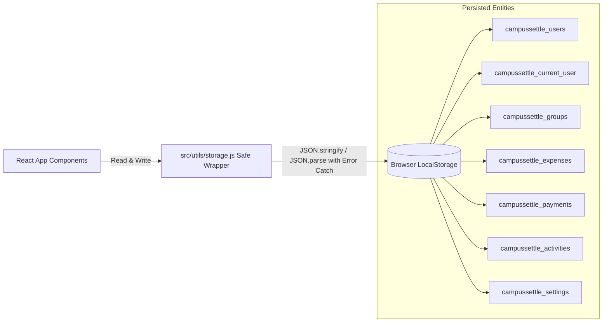

# CampusSettle — Complete Technology Stack Specification (Tech Stack Guide)

Yeh document **CampusSettle** project me use hone wali har ek technology, library, framework, tool, aur algorithm ka complete reference guide hai. Isme details di gayi hain ki har tech ka **Version kya hai**, **Use kahan kiya gaya hai**, **Kyun choose kiya gaya hai**, aur **Project me uska role kya hai**.

---

## 1. High-Level Tech Stack Overview

| Category | Technology / Library | Version | Primary Role & Responsibility |
| :--- | :--- | :--- | :--- |
| **Frontend Framework** | **React** | `^19.2.8` | Component-based UI rendering, custom hooks, and reactive state management |
| **Build Tool & Bundler** | **Vite** | `^8.3.0` | Ultra-fast development server with instant Hot Module Replacement (HMR) & ESBuild bundling |
| **Styling Engine** | **Tailwind CSS v4** | `^4.3.3` | Utility-first CSS engine with modern theme tokens, glassmorphism, responsive grid & dark mode |
| **Vite Integration** | **@tailwindcss/vite** | `^4.3.3` | Zero-config native Vite plugin for high-speed Tailwind CSS compilation |
| **Client Routing** | **React Router DOM** | `^7.18.3` | SPA client-side routing, nested routes, route params (`/:id`), and protected route guards |
| **Iconography** | **Lucide React** | `^1.44.0` | Clean, modern feather-style SVG vector icons across navigation, actions, and badges |
| **Animations** | **Framer Motion** | `^13.2.0` | Fluid entrance transitions, modal spring animations, and tab indicators |
| **Data Visualization** | **Recharts** | `^3.10.1` | Interactive SVG monthly spending bar charts and category breakdown donut charts |
| **Date & Time** | **date-fns** | `^4.4.0` | Relative time strings (`formatDistanceToNow`), date filtering, and timestamp formatting |
| **Notifications** | **React Hot Toast** | `^2.6.0` | Non-intrusive, customizable toast alerts for user feedback on actions |
| **Code Quality** | **ESLint** | `^10.10.0` | Linting, syntax rules, and React Hooks best-practice enforcement |
| **Financial Engines** | **Custom JavaScript Algorithms** | Custom | Greedy debt simplification, round-robin penny balancing, and pairwise debt matrices |
| **Data Persistence** | **Browser LocalStorage API** | Web API | Zero-latency client-side persistence with safe serialization wrapper |
| **Backend / DB Target** | **PostgreSQL & Prisma ORM** | Standard | Relational database schema with foreign keys, cascades, indexes, and migrations |

---

## 2. Deep-Dive: Core Technologies & Why They Were Chosen

---

### ⚛️ 1. React (v19.2.8)
* **Kahan use hua**: Poore frontend application ka base (`src/App.jsx`, `src/pages/*`, `src/components/*`).
* **Kyun use kiya gaya**:
  - React 19 modern hooks (`useState`, `useEffect`, `useMemo`, `useCallback`) provide karta hai jisse complex financial state (jaise user share, group balances, spending totals) bina external state management (Redux/Zustand) ke efficiently compute hoti hai.
  - Virtual DOM diffing ensure karta hai ki jab user line-item add kare ya split switch kare toh sirf relevant DOM update ho, poora page re-render na ho.
* **Code Example (`src/pages/Balances.jsx`)**:
  ```jsx
  const groupBalances = useMemo(() => {
    return calculateGroupBalances(expenses, payments, group?.members || []);
  }, [expenses, payments, group]);
  ```

---

### ⚡ 2. Vite (v8.3.0) + @vitejs/plugin-react (v6.1.1)
* **Kahan use hua**: Project environment, dev server, and build pipeline (`vite.config.js`, `package.json`).
* **Kyun use kiya gaya**:
  - Traditional Webpack ke comparison me Vite 10x se 100x fast start hota hai kyunki yeh native ES Modules (ESM) aur Rollup/OxC use karta hai.
  - **Instant HMR (Hot Module Replacement)**: Code me change karte hi bina state reset hue fraction of a second me browser UI update ho jata hai.
* **Configuration (`vite.config.js`)**:
  ```javascript
  import { defineConfig } from 'vite';
  import react from '@vitejs/plugin-react';
  import tailwindcss from '@tailwindcss/vite';

  export default defineConfig({
    plugins: [react(), tailwindcss()],
  });
  ```

---

### 🎨 3. Tailwind CSS v4 (^4.3.3) & @tailwindcss/vite
* **Kahan use hua**: Har ek component ki styling (`src/index.css`, JSX `className` attributes).
* **Kyun use kiya gaya**:
  - Tailwind CSS v4 me koi `tailwind.config.js` ki zarurat nahi hoti; direct `@import "tailwindcss";` se load hota hai.
  - Built-in dynamic utilities: Responsive layouts (`sm:`, `md:`, `lg:`), flexbox/grid, translucent glassmorphism (`backdrop-blur-md bg-white/80`), badges, rounded corners (`rounded-2xl`, `rounded-3xl`), shadows, and transitions.
  - Bundle size extremely small hota hai kyunki production build me sirf wahi CSS compile hoti hai jo actual code me use hui ho.
* **Entry Point (`src/index.css`)**:
  ```css
  @import "tailwindcss";

  @layer base {
    body {
      font-family: 'Inter', system-ui, sans-serif;
      background-color: #f8fafc;
      color: #0f172a;
    }
  }
  ```

---

### 🧭 4. React Router DOM (v7.18.3)
* **Kahan use hua**: Single Page Application (SPA) routing (`src/App.jsx`, `src/components/layout/Sidebar.jsx`).
* **Kyun use kiya gaya**:
  - Page refresh kiye bina instant view switching provide karta hai.
  - Route parameters (`/groups/:id`, `/expenses/:id`) dynamic entity fetching allow karte hain.
  - Protected route wrapper (`ProtectedRoute.jsx`) check karta hai ki user authenticated hai ya nahi; unauthenticated access par user ko `/login` par deflect karta hai.
* **Registered Routes**:
  - `/` $\rightarrow$ Auto-redirect to `/dashboard`
  - `/login`, `/signup` $\rightarrow$ Auth pages
  - `/dashboard` $\rightarrow$ Main financial metrics
  - `/groups`, `/groups/:id` $\rightarrow$ Groups & members management
  - `/expenses`, `/expenses/add`, `/expenses/:id` $\rightarrow$ Expenses listing & wizard
  - `/balances` $\rightarrow$ Who-owes-whom ledger & breakdowns
  - `/settlements` $\rightarrow$ Settlement recommendations & payment records
  - `/activity` $\rightarrow$ Global timeline audit feed
  - `/profile`, `/settings` $\rightarrow$ User preferences & demo reset

---

### 📊 5. Recharts (v3.10.1)
* **Kahan use hua**: Dashboard spending analytics (`src/components/dashboard/SpendingChart.jsx`).
* **Kyun use kiya gaya**:
  - Pure SVG-based declarative chart components jo mobile aur desktop dono screen sizes par dynamically scale karte hain (`ResponsiveContainer`).
  - **BarChart**: Month-by-month spending trends display karta hai with smooth gradients.
  - **PieChart / Donut**: Categories (Food, Travel, Bills, Entertainment) ka proportional breakdown show karta hai.
  - Built-in animated tooltip formatting with custom currency integration (`formatCurrency(val)`).

---

### 🎭 6. Framer Motion (v13.2.0)
* **Kahan use hua**: Modal animations, page entrance transitions, and interactive cards (`src/components/common/Modal.jsx`, `src/components/dashboard/StatCard.jsx`).
* **Kyun use kiya gaya**:
  - UI ko modern and premium feel dene ke liye spring physics-based transitions provide karta hai.
  - Modals smooth scale-up (`initial={{ opacity: 0, scale: 0.95 }}`) ke sath open hote hain aur backdrop fade transition karti hai.

---

### 🔣 7. Lucide React (v1.44.0)
* **Kahan use hua**: Complete application ke icons (`Sidebar.jsx`, `Header.jsx`, `Input.jsx`, `Button.jsx`, etc.).
* **Kyun use kiya gaya**:
  - Consistent modern stroke width, zero pixelation, lightweight tree-shakeable SVG icons.
  - Icons used: `Sparkles`, `Plus`, `Users`, `Receipt`, `Scale`, `ArrowRightLeft`, `Activity`, `Settings`, `User`, `Mail`, `Phone`, `Lock`, `Check`, `Trash2`, `Edit2`, `Download`, `RefreshCw`.

---

### 📅 8. date-fns (v4.4.0)
* **Kahan use hua**: Dates formatting, relative time calculation, and month comparisons (`src/utils/`, `Activity.jsx`, `SpendingChart.jsx`).
* **Kyun use kiya gaya**:
  - Heavy libraries (like Moment.js) ke opposite `date-fns` modular aur immutable hai.
  - Functions used:
    - `format(new Date(date), 'MMM dd, yyyy')` $\rightarrow$ *"Mar 09, 2026"*
    - `formatDistanceToNow(new Date(date), { addSuffix: true })` $\rightarrow$ *"3 hours ago"*
    - `isThisMonth(new Date(date))` $\rightarrow$ Month filter in dashboard stats

---

### 🍞 9. React Hot Toast (v2.6.0)
* **Kahan use hua**: User feedback notifications (`toast.success()`, `toast.error()`).
* **Kyun use kiya gaya**:
  - Native browser `alert()` disruptive aur outdated hote hain. `react-hot-toast` elegant, floating, non-blocking toast cards dikhata hai jo 3 seconds me auto-dismiss ho jati hain.

---

## 3. Internal Algorithmic & Financial Engines (Custom Logic)

Hamari application sirf static UI nahi hai; isme 4 core custom financial engines hain:

### 1. Split Calculation Engine (`src/utils/splitCalculator.js`)
* **Equal Split with Penny/Paise Balancing**:
  - Formula: $\text{Base} = \lfloor \frac{\text{Total}}{\text{Count}} \times 100 \rfloor / 100$
  - $\text{Remainder} = \text{Total} - (\text{Base} \times \text{Count})$
  - Remainder cents/paise ko 1-by-1 starting participants me distribute karke exact sum balance kiya jata hai.
* **Item-Based Split**:
  - Har line item (e.g. Pizza, Coffee) ke cost ko uske specific consumers me barabar divide karke per-user aggregates compute karta hai.
* **Sum Validation**:
  - Verification check: $|\text{Total} - \sum \text{Splits}| < 0.01$.

### 2. Pairwise Debt Matrix & Net Balance Engine (`src/utils/balanceCalculator.js`)
* Matrix structure: $\text{pairwiseMatrix}[\text{Debtor}][\text{Creditor}] = \text{Amount}$
* Expenses aur payments ko scan karke directional debts aur net balance ($TotalPaid - TotalShare$) calculate karta hai.
* Har debt ke peeche ke exact bills ka itemized breakdown array generate karta hai.

### 3. Greedy Debt Simplification Algorithm (`src/utils/settlementCalculator.js`)
* **Problem**: Agar A owes B, and B owes C, toh multiple transactions execute hote hain ($O(N^2)$ cyclic debt graph).
* **Solution**: Graph optimization greedy algorithm:
  1. Net debtors (negative balance) aur net creditors (positive balance) ko sort karta hai by balance descending.
  2. Largest debtor ko largest creditor ke sath match karke settle karta hai:
     $$\text{Settle Amount} = \min(|\text{Debtor Balance}|, |\text{Creditor Balance}|)$$
  3. Minimum possible transactions me poora group settle ho jata hai!

### 4. Dynamic Multi-Currency Formatter (`src/utils/currencyFormatter.js`)
* Support karta hai: `INR (₹)`, `USD ($)`, `EUR (€)`, `GBP (£)`.
* Internationalization: `Intl.NumberFormat('en-IN')` / `Intl.NumberFormat('en-US')` standard comma formatting execute karta hai.

---

## 4. Storage & Persistence Architecture



* **Zero Data Corruption**: `storage.js` me `try...catch` blocks lage hain taaki agar invalid JSON ya storage full ho toh app crash na ho.
* **Instant Reactivity**: Storage changes trigger automatic state updates across views.

---

## 5. Development Tools & Tooling Setup

- **Node.js**: Modern JavaScript runtime (v18+ / v20+ recommended).
- **ESLint v10**: Enforces modern code style, forbids unused variables, and guarantees React Hook rules.
- **Git Version Control**: Multi-branch support (`main`, `bharat`) tracked against GitHub repository.
